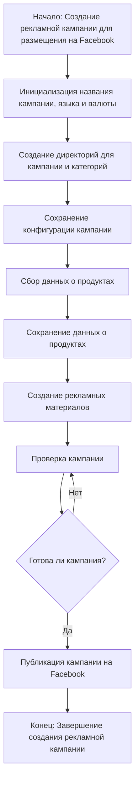

# Инструкция по модулю `campaign`

## Обзор

Модуль `campaign` предназначен для управления процессом создания и публикации рекламных кампаний на Facebook. Он включает функционал для инициализации параметров кампании (название, язык, валюта), создания структуры директорий, сохранения конфигураций для новой кампании, сбора и сохранения данных о продуктах через `ali` или `html`, генерации рекламных материалов, проверки кампании и публикации ее на Facebook.

## Подробней

Модуль автоматизирует процесс создания рекламных кампаний в Facebook, начиная с инициализации параметров и заканчивая публикацией. Он предоставляет инструменты для сбора и обработки данных о продуктах, генерации рекламных материалов и проверки готовности кампании к публикации. Модуль помогает стандартизировать и упростить процесс создания рекламных кампаний, снижая ручной труд и повышая эффективность.

## Классы

В данном фрагменте кода классы отсутствуют.

## Функции

В данном фрагменте кода функции отсутствуют.

## Параметры

-   `campaign` (str): Описание модуля `campaign`.
    Модуль `campaign` предназначен для управления процессом создания и публикации рекламных кампаний на Фейсбук.
    Он включает функционал для инициализации параметров кампании (название, язык, валюта),
    создания структуры директорий, сохранения конфигураций для новой кампании,
    сбора и сохранения данных о продуктах через `ali` или `html`,
    генерации рекламных материалов, проверки кампании и публикации ее на Facebook.

## Mermaid-диаграмма

**Описание**: Диаграмма описывает процесс создания рекламной кампании, начиная с инициализации параметров и заканчивая публикацией на Facebook. Каждый шаг процесса представлен в виде узла, а переходы между шагами - в виде стрелок. Условный оператор (ромб) показывает, что процесс проверки кампании может повторяться до тех пор, пока кампания не будет готова к публикации.