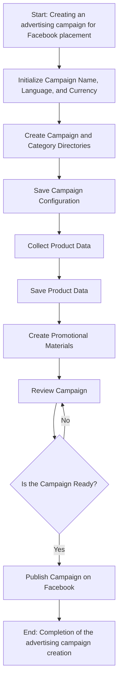
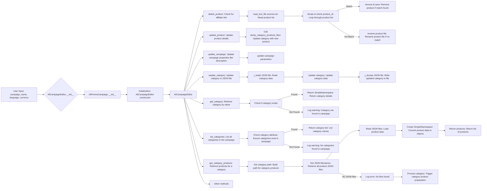
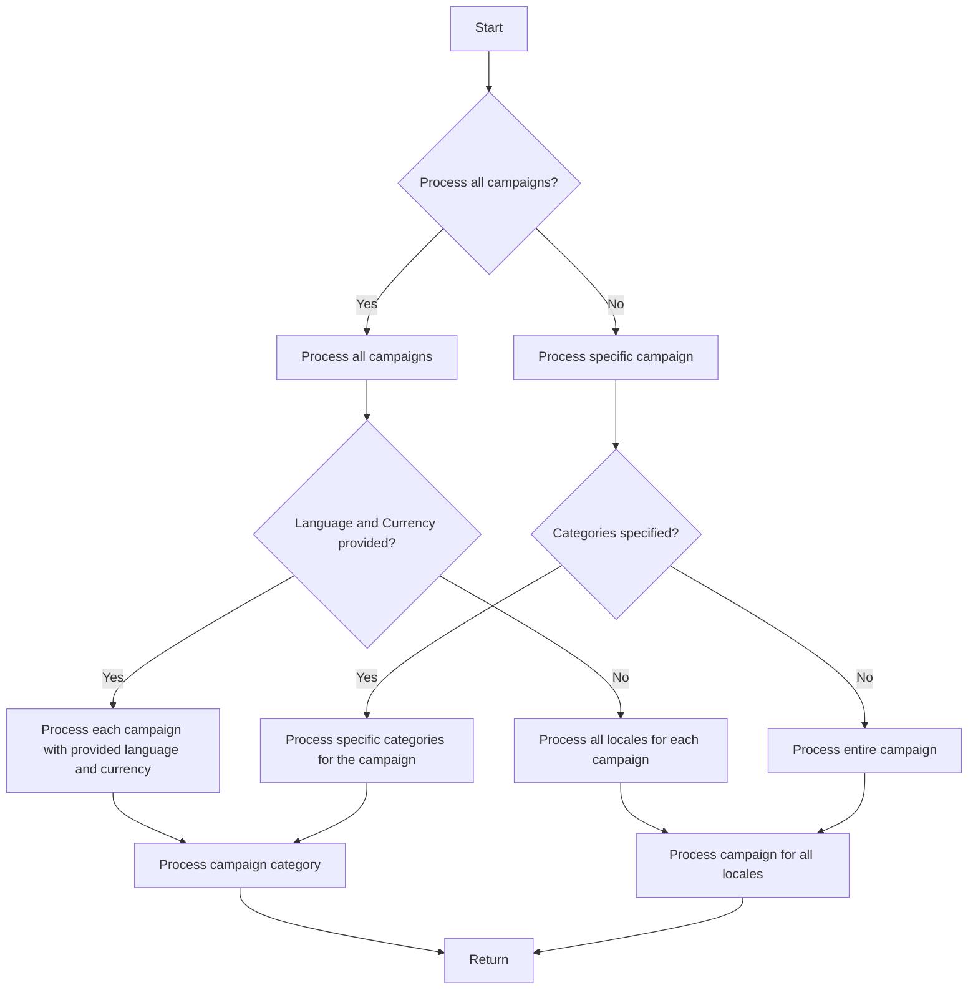

# Модуль `campaign`

## Обзор

Модуль `campaign` предназначен для управления процессом создания и публикации рекламных кампаний в Facebook. Он включает в себя функциональность для инициализации параметров кампании (название, язык, валюта), создания структуры каталогов, сохранения конфигураций для новой кампании, сбора и сохранения данных о товарах через `ali` или `html`, генерации рекламных материалов, просмотра кампании и публикации ее в Facebook.

## Подробней

Модуль предоставляет функциональность для автоматизации процесса создания и управления рекламными кампаниями, начиная с инициализации основных параметров и заканчивая публикацией готовой кампании на платформе Facebook. Это включает в себя сбор данных о товарах, генерацию рекламных материалов и обеспечение готовности кампании к запуску.

## Схемы рабочих процессов

### Создание рекламной кампании для размещения в Facebook

**Описание шагов**:

- **Шаг 1**: Начало процесса.
- **Шаг 2**: Инициализация деталей кампании: определяются название кампании, язык и валюта. Пример: Название кампании: "Летняя распродажа", Язык: "Русский", Валюта: "RUB".
- **Шаг 3**: Создание каталогов кампании и категорий: создаются необходимые каталоги или файлы для кампании. Пример: Создается структура папок в файловой системе для хранения ресурсов кампании.
- **Шаг 4**: Сохранение конфигурации кампании: сохраняются инициализированные детали кампании. Пример: Данные записываются в базу данных или файл конфигурации.
- **Шаг 5**: Сбор данных о товарах: собираются данные, относящиеся к товарам, которые будут продвигаться в рамках кампании. Пример: Из системы инвентаризации извлекаются ID товаров, описания, изображения и цены.
- **Шаг 6**: Сохранение данных о товарах: сохраняются собранные данные о товарах. Пример: Данные записываются в таблицу базы данных, предназначенную для товаров кампании.
- **Шаг 7**: Создание рекламных материалов: генерируются или выбираются графические элементы, баннеры и другие рекламные ресурсы. Пример: Изображения и описания адаптируются для привлечения клиентов.
- **Шаг 8**: Проверка кампании: процесс проверки подтверждает готовность компонентов кампании. Пример: Проводится оценка качества и полноты всех компонентов кампании человеком или системой.
- **Шаг 9**: Кампания готова?: проверка для определения, является ли кампания полной и готовой к публикации. Пример: Логический флаг сигнализирует "Да", если все на месте, в противном случае "Нет", инициируя возврат к предыдущему шагу для внесения исправлений.
- **Шаг 10**: Публикация кампании: кампания становится активной на платформе и готова к маркетинговым усилиям. Пример: Выполняются API-вызовы для публикации кампании на соответствующей платформе.
- **Шаг 11**: Завершение процесса создания кампании.

### Редактирование кампании

**Описание шагов**:

- **A**: Пользовательский ввод: `campaign_name`, `language`, `currency`.
- **B**: Инициализация `AliCampaignEditor` (`AliCampaignEditor.__init__`).
- **C**: Инициализация `AliPromoCampaign` (`AliPromoCampaign.__init__`).
- **D**: Инициализация: конструктор `AliCampaignEditor`.
- **E**: `AliCampaignEditor`.
- **F**: `delete_product`: Проверка наличия партнерской ссылки.
- **G**: `read_text_file sources.txt`: Чтение списка продуктов.
- **H**: Итерация и проверка `product_id`: Цикл по списку продуктов.
    - **Match**: Совпадение найдено.
        - **I**: `remove & save`: Удаление продукта, если найдено совпадение.
    - **No Match**: Совпадение не найдено.
        - **J**: `rename product file`: Переименование файла продукта, если нет совпадения.
- **K**: `update_product`: Обновление деталей продукта.
- **L**: Вызов `dump_category_products_files`: Обновление категории новым продуктом.
- **M**: `update_campaign`: Обновление свойств кампании, таких как описание.
- **N**: Обновление параметров кампании.
- **O**: `update_category`: Обновление категории в JSON-файле.
- **P**: `j_loads JSON file`: Чтение данных категории.
- **Q**: `Update category`: Обновление данных категории.
- **R**: `j_dumps JSON file`: Запись обновленной категории в файл.
- **S**: `get_category`: Получение категории по имени.
- **T**: Проверка, существует ли категория.
    - **Found**: Найдено.
        - **U**: Возврат `SimpleNamespace`: Возврат деталей категории.
    - **Not Found**: Не найдено.
        - **V**: Логирование предупреждения: Категория не найдена в кампании.
- **W**: `list_categories`: Перечисление всех категорий в кампании.
- **X**: Проверка атрибута категории: Убедиться, что категории существуют в кампании.
    - **Found**: Найдено.
        - **Y**: Возврат списка категорий: Перечисление названий категорий.
    - **Not Found**: Не найдено.
        - **Z**: Логирование предупреждения: Категории не найдены в кампании.
- **AA**: `get_category_products`: Получение продуктов для категории.
- **AB**: Получение пути категории: Построение пути для продуктов категории.
- **AC**: Получение имен JSON-файлов: Получение всех JSON-файлов продуктов.
    - **No JSON files**: JSON-файлы не найдены.
        - **AG**: Логирование ошибки: Файлы не найдены.
        - **AH**: Обработка категории: Запуск подготовки продуктов категории.
- **AD**: Чтение JSON-файлов: Загрузка данных продуктов.
- **AE**: Создание `SimpleNamespace`: Преобразование данных продуктов в объекты.
- **AF**: Возврат продуктов: Возврат списка продуктов.
- **AI**: Другие методы.

### Подготовка кампании

**Описание шагов**:
- **A**: Старт
- **B**: Обработать все кампании?
    - Да -> **C**: Обработать все кампании
    - Нет -> **D**: Обработать конкретную кампанию
- **C**: Обработать все кампании
- **D**: Обработать конкретную кампанию
- **E**: Предоставлены язык и валюта?
    - Да -> **F**: Обработать каждую кампанию с указанным языком и валютой
    - Нет -> **G**: Обработать все локали для каждой кампании
- **F**: Обработать каждую кампанию с указанным языком и валютой
- **G**: Обработать все локали для каждой кампании
- **H**: Указаны категории?
    - Да -> **I**: Обработать конкретные категории для кампании
    - Нет -> **J**: Обработать всю кампанию
- **I**: Обработать конкретные категории для кампании
- **J**: Обработать всю кампанию
- **K**: Обработать категорию кампании
- **L**: Обработать кампанию для всех локалей
- **M**: Вернуть