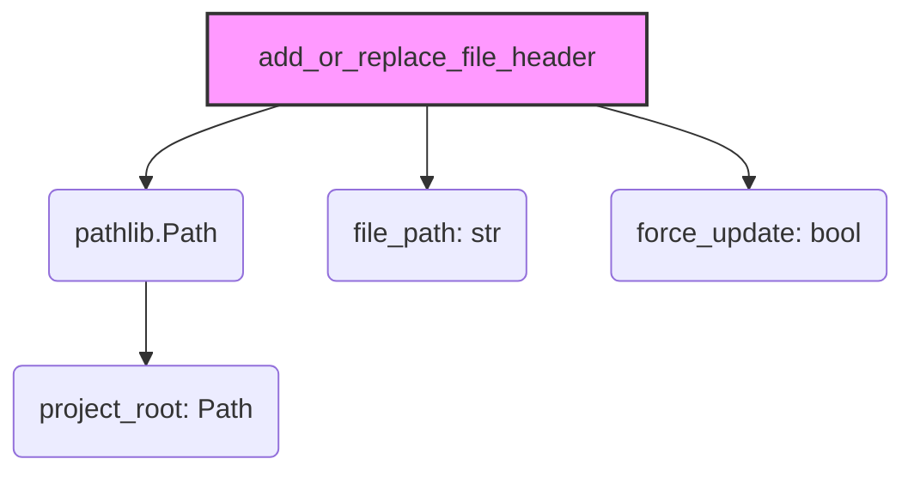

# Модуль для обновления заголовков файлов в проекте `hypotez`

## Обзор

Модуль предназначен для автоматического обновления заголовков в файлах Python проекта `hypotez`.
Он добавляет или заменяет строки с информацией о кодировке, интерпретаторе и документацией модуля.
Скрипт предназначен для поддержания единообразного стиля оформления кода во всем проекте.

## Подробнее

Модуль предназначен для обеспечения единого стандарта оформления файлов в проекте `hypotez`. 
Он гарантирует, что каждый файл содержит необходимую информацию, такую как кодировка, указание интерпретатора и docstring. 
Это упрощает поддержку и понимание кода, а также автоматизирует процесс приведения файлов к единому стилю.

## Функции

### `add_or_replace_file_header`

```python
def add_or_replace_file_header(file_path: str, project_root: Path, force_update: bool):
    """
    Добавляет или заменяет заголовок, строки интерпретатора и строку документации модуля в указанном файле Python.

    Args:
        file_path (str): Путь к файлу, в котором необходимо обновить заголовок.
        project_root (Path): Корневой путь к проекту.
        force_update (bool): Флаг, указывающий на необходимость принудительного обновления,
                             даже если заголовок уже существует.

    Returns:
        None: Функция ничего не возвращает.

    Raises:
        FileNotFoundError: Если указанный файл не существует.
        PermissionError: Если нет прав на чтение или запись файла.
        Exception: Другие исключения, возникающие при работе с файловой системой.

    Example:
        >>> from pathlib import Path
        >>> file_path = "example.py"
        >>> project_root = Path(".")
        >>> force_update = True
        >>> add_or_replace_file_header(file_path, project_root, force_update)
    """
    # Логика добавления заголовков и интерпретаторов...
    ...
```

**Назначение**: Добавляет или заменяет стандартный заголовок в файлах Python проекта.

**Параметры**:
- `file_path` (str): Путь к файлу, в котором необходимо обновить заголовок.
- `project_root` (Path): Корневой путь к проекту.
- `force_update` (bool): Флаг, указывающий на необходимость принудительного обновления, даже если заголовок уже существует.

**Возвращает**:
- `None`: Функция ничего не возвращает.

**Вызывает исключения**:
- `FileNotFoundError`: Если указанный файл не существует.
- `PermissionError`: Если нет прав на чтение или запись файла.
- `Exception`: Другие исключения, возникающие при работе с файловой системой.

**Как работает функция**:

1. Проверяет существование файла по указанному пути.
2. Открывает файл для чтения и записи.
3. Проверяет наличие необходимых строк (кодировка, интерпретатор, docstring) в начале файла.
4. Если `force_update` установлен в `True` или необходимые строки отсутствуют, заменяет или добавляет их.
5. Сохраняет изменения в файле.

**Используемые модули**:
- `pathlib`: Для работы с путями к файлам.
- `io`: Для чтения и записи файлов.

**Примеры**:

```python
from pathlib import Path

file_path = "example.py"
project_root = Path(".")
force_update = True
add_or_replace_file_header(file_path, project_root, force_update)
```

## Блок-схема

```mermaid
graph LR
    A[Начало] --> B{Проверка существования файла};
    B -- Файл существует --> C[Открыть файл для чтения и записи];
    B -- Файл не существует --> E[Выбросить FileNotFoundError];
    C --> D{Проверка наличия необходимых строк (кодировка, интерпретатор, docstring)};
    D -- Строки присутствуют и force_update=False --> F[Завершение];
    D -- Строки отсутствуют или force_update=True --> G[Заменить или добавить строки];
    G --> H[Сохранить изменения в файле];
    H --> F[Завершение];
    E --> F;
    style A fill:#f9f,stroke:#333,stroke-width:2px
    style F fill:#f9f,stroke:#333,stroke-width:2px
```

**Примеры для каждого логического блока:**

- **A (Начало)**: Начало выполнения функции `add_or_replace_file_header`.
- **B (Проверка существования файла)**: Проверяется, существует ли файл `example.py`. Если файл не существует, выбрасывается исключение `FileNotFoundError`.
- **C (Открыть файл для чтения и записи)**: Открывается файл `example.py` для чтения и записи, чтобы проверить и изменить его содержимое.
- **D (Проверка наличия необходимых строк)**: Проверяется, содержит ли файл `example.py` строки кодировки, интерпретатора и docstring.
- **E (Выбросить FileNotFoundError)**: Если файл не существует, выбрасывается исключение `FileNotFoundError`.
- **F (Завершение)**: Функция завершает выполнение.
- **G (Заменить или добавить строки)**: Если `force_update` равен `True` или необходимые строки отсутствуют, добавляются или заменяются строки кодировки, интерпретатора и docstring.
- **H (Сохранить изменения в файле)**: Измененное содержимое файла сохраняется.

## Диаграмма зависимостей (mermaid)



**Объяснение зависимостей:**

- `add_or_replace_file_header`: Функция, которая добавляет или заменяет заголовок файла.
- `pathlib.Path`: Используется для представления путей к файлам и каталогам в файловой системе. Позволяет удобно манипулировать путями.
- `file_path: str`: Строковый параметр, представляющий путь к файлу, который нужно обновить.
- `force_update: bool`: Логический параметр, определяющий, следует ли принудительно обновлять заголовок, даже если он уже существует.
- `project_root: Path`: Объект `Path`, представляющий корневой каталог проекта.

## Объяснение

**Импорты**:

- `pathlib`: Используется для представления файловых путей в кросс-платформенном формате. Класс `Path` из этого модуля позволяет удобно манипулировать путями к файлам и директориям.

**Функции**:

- `add_or_replace_file_header(file_path: str, project_root: Path, force_update: bool)`:
    - **Аргументы**:
        - `file_path` (str): Путь к файлу, в котором необходимо обновить заголовок.
        - `project_root` (Path): Корневой путь к проекту.
        - `force_update` (bool): Флаг, указывающий на необходимость принудительного обновления, даже если заголовок уже существует.
    - **Возвращаемое значение**:
        - None: Функция ничего не возвращает, а изменяет файл напрямую.
    - **Назначение**:
        - Добавляет или заменяет заголовок, строки интерпретатора и строку документации модуля в указанном файле Python.
    - **Примеры**:
        ```python
        from pathlib import Path
        file_path = "example.py"
        project_root = Path(".")
        force_update = True
        add_or_replace_file_header(file_path, project_root, force_update)
        ```

**Переменные**:

- `file_path` (str): Путь к файлу для обновления заголовка.
- `project_root` (Path): Корневой путь к проекту.
- `force_update` (bool): Флаг принудительного обновления.

**Потенциальные ошибки и области для улучшения**:

- **Обработка исключений**: В коде указаны возможные исключения (`FileNotFoundError`, `PermissionError`, `Exception`), но нет конкретной реализации их обработки. Рекомендуется добавить блоки `try...except` для корректной обработки исключений и логирования ошибок.
- **Детализация логики**: Код содержит комментарий `# Логика добавления заголовков и интерпретаторов...` и `...`, что указывает на отсутствие реализации основной логики функции. Необходимо реализовать логику добавления или замены заголовков.
- **Использование `io`**: В описании указано использование модуля `io` для чтения и записи файлов, но в коде это не отражено. Необходимо использовать этот модуль для работы с файлами.

**Взаимосвязь с другими частями проекта**:

- Этот модуль предназначен для поддержания единого стиля оформления кода во всем проекте `hypotez`. Он может использоваться в скриптах автоматической проверки стиля кода или в процессе сборки проекта.