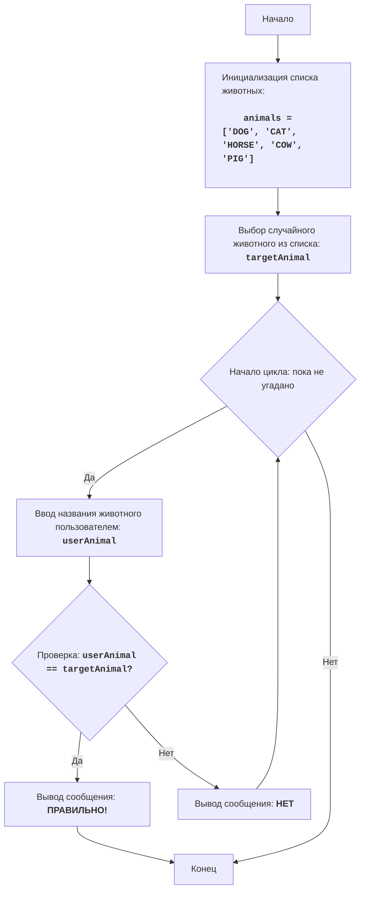

"""
ANIMAL:
=================
Сложность: 4
-----------------
Игра "ANIMAL" - это игра в угадывание животного, в которой компьютер выбирает случайное животное из списка, а игрок пытается его угадать, вводя свои предположения. Игра продолжается до тех пор, пока игрок не угадает животное.

Правила игры:
1.  Компьютер выбирает случайное животное из предопределенного списка.
2.  Игрок вводит свои предположения о загаданном животном.
3.  После каждой попытки компьютер сообщает, угадал ли игрок животное или нет.
4.  Игра продолжается до тех пор, пока игрок не угадает загаданное животное.
-----------------
Алгоритм:
1.  Задать список животных.
2.  Выбрать случайное животное из списка.
3.  Начать цикл "пока животное не угадано":
    3.1 Запросить у игрока ввод названия животного.
    3.2 Если введенное название совпадает с загаданным животным, перейти к шагу 4.
    3.3 Иначе, вывести сообщение "НЕТ".
4. Вывести сообщение "ПРАВИЛЬНО!".
5. Конец игры.
-----------------
Блок-схема:

Legenda:
    Start - Начало программы.
    InitializeAnimals - Инициализация списка животных.
    ChooseRandomAnimal - Выбор случайного животного из списка и сохранение его в переменной targetAnimal.
    LoopStart - Начало цикла, который продолжается, пока животное не угадано.
    InputAnimal - Запрос у пользователя ввода названия животного и сохранение его в переменной userAnimal.
    CheckAnimal - Проверка, равно ли введенное название животного userAnimal загаданному животному targetAnimal.
    OutputWin - Вывод сообщения о победе, если названия животных равны.
    End - Конец программы.
    OutputWrong - Вывод сообщения "НЕТ", если введенное название животного не совпадает с загаданным.
"""
import random

# Список животных для игры
animals = ['DOG', 'CAT', 'HORSE', 'COW', 'PIG']

# Выбираем случайное животное из списка
targetAnimal = random.choice(animals)

# Начинаем цикл, пока животное не будет угадано
while True:
    # Запрашиваем у пользователя ввод названия животного
    userAnimal = input("Угадайте животное (DOG, CAT, HORSE, COW, PIG): ").upper()

    # Проверка, угадал ли пользователь животное
    if userAnimal == targetAnimal:
        print("ПРАВИЛЬНО!") # Сообщаем о правильном ответе
        break # Завершаем цикл, если животное угадано
    else:
        print("НЕТ") # Сообщаем о неверном ответе

"""
Объяснение кода:

1.  **Импорт модуля `random`**:
    -   `import random`: Импортирует модуль `random`, который используется для случайного выбора животного.

2.  **Список животных**:
    -   `animals = ['DOG', 'CAT', 'HORSE', 'COW', 'PIG']`: Создает список строк с названиями животных.

3.  **Выбор случайного животного**:
    -   `targetAnimal = random.choice(animals)`: Выбирает случайное животное из списка `animals` и сохраняет его в переменной `targetAnimal`.

4.  **Основной цикл игры `while True:`**:
    -   Бесконечный цикл, который продолжается до тех пор, пока игрок не угадает животное.
    -   **Ввод данных**:
        -   `userAnimal = input("Угадайте животное (DOG, CAT, HORSE, COW, PIG): ").upper()`: Запрашивает у пользователя ввод названия животного и приводит его к верхнему регистру для сравнения без учета регистра.
    -   **Условие победы**:
        -   `if userAnimal == targetAnimal:`: Проверяет, совпадает ли введенное пользователем название животного с загаданным.
        -   `print("ПРАВИЛЬНО!")`: Выводит сообщение о победе, если животное угадано.
        -   `break`: Завершает цикл (игру), если животное угадано.
    -   **Сообщение о неверном ответе**:
        -   `else:`: Выполняется, если введенное название животного не совпадает с загаданным.
        -   `print("НЕТ")`: Выводит сообщение "НЕТ", если ответ неверный.
"""
