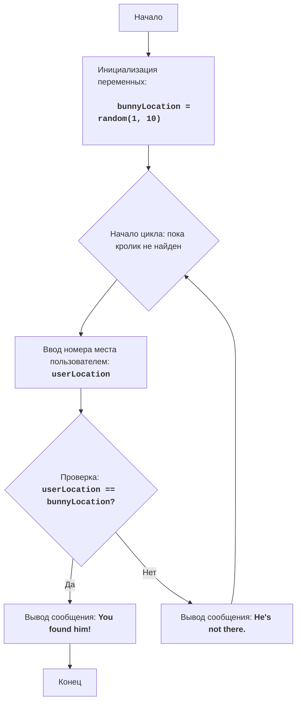

"""
BUNNY:
=================
Сложность: 4
-----------------
Игра "BUNNY" представляет собой текстовую игру, в которой игрок пытается найти кролика, спрятанного в одном из десяти мест.
Игрок выбирает номер места, и игра сообщает, был ли кролик найден в этом месте. Игра продолжается до тех пор, пока кролик не будет найден.

Правила игры:
1. Кролик случайно прячется в одном из десяти мест (пронумерованных от 1 до 10).
2. Игрок выбирает номер места, где, по его мнению, находится кролик.
3. Игра сообщает, был ли кролик найден в выбранном месте.
4. Игра заканчивается, когда кролик найден.
-----------------
Алгоритм:
1. Сгенерировать случайное число в диапазоне от 1 до 10, которое будет представлять место, где спрятан кролик.
2. Начать цикл "пока кролик не найден":
   2.1 Запросить у игрока ввод номера места от 1 до 10.
   2.2 Если номер места равен месту, где спрятан кролик, вывести сообщение "You found him!".
      2.2.1 Завершить игру.
   2.3 Иначе, если номер места не равен месту, где спрятан кролик, вывести сообщение "He's not there.".
      2.3.1 Продолжить игру (вернуться в начало цикла).
-----------------
Блок-схема:

Legenda:
    Start - Начало программы.
    InitializeVariables - Инициализация переменной: bunnyLocation (место кролика) генерируется случайным образом от 1 до 10.
    LoopStart - Начало цикла, который продолжается, пока кролик не найден.
    InputLocation - Запрос у пользователя ввода номера места и сохранение его в переменной userLocation.
    CheckLocation - Проверка, равно ли введенное место userLocation месту кролика bunnyLocation.
    OutputWin - Вывод сообщения о победе "You found him!", если места совпадают.
    End - Конец программы.
    OutputLose - Вывод сообщения "He's not there.", если места не совпадают.
"""
import random

# Генерируем случайное число от 1 до 10 для места кролика
bunnyLocation = random.randint(1, 10)

# Основной игровой цикл
while True:
    # Запрашиваем у пользователя номер места
    try:
        userLocation = int(input("Где кролик (1-10)? "))
    except ValueError:
        print("Пожалуйста, введите целое число от 1 до 10.")
        continue

    # Проверка, угадал ли пользователь место кролика
    if userLocation == bunnyLocation:
        print("You found him!")  # Выводим сообщение, если кролик найден
        break  # Завершаем цикл, если кролик найден
    else:
        print("He's not there.")  # Выводим сообщение, если кролик не найден

"""
Объяснение кода:
1.  **Импорт модуля `random`**:
    -  `import random`: Импортирует модуль `random`, который используется для генерации случайного числа, представляющего место, где спрятан кролик.
2.  **Инициализация местоположения кролика**:
    -   `bunnyLocation = random.randint(1, 10)`: Генерирует случайное целое число в диапазоне от 1 до 10 и сохраняет его в переменной `bunnyLocation`. Это число представляет место, где спрятан кролик.
3.  **Основной цикл `while True:`**:
    -   Этот цикл будет выполняться до тех пор, пока кролик не будет найден (пока не выполнится команда `break`).
    -   **Ввод номера места**:
        -   `try...except ValueError`: Блок try-except обрабатывает возможные ошибки ввода. Если пользователь введет не целое число, то будет выведено сообщение об ошибке.
        -   `userLocation = int(input("Где кролик (1-10)? "))`: Запрашивает у пользователя номер места, где, по его мнению, спрятан кролик, и преобразует ввод в целое число.
    -   **Проверка местоположения**:
        -   `if userLocation == bunnyLocation`: Проверяет, совпадает ли введенный номер места с местоположением кролика.
        -   `print("You found him!")`: Если места совпадают, выводит сообщение о том, что кролик найден.
        -   `break`: Завершает игровой цикл.
        -   `else:`: Если места не совпадают.
        -  `print("He's not there.")`: Выводит сообщение о том, что кролик не найден в выбранном месте.
"""
