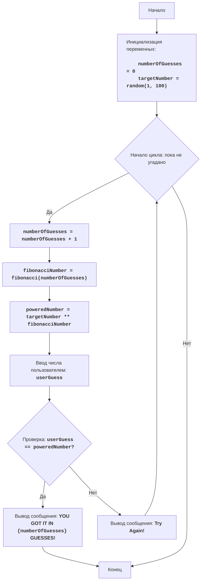

FIPOWR:
=================
Сложность: 6
-----------------
Игра "Фибоначчи в степени" - это математическая игра, где компьютер выбирает случайное число в диапазоне от 1 до 100, игрок вводит число.
Компьютер возводит случайно выбранное число в степень числа фибоначчи, которое соответствует номеру попытки, и сравнивает с числом пользователя.
Игра продолжается до тех пор, пока числа не будут равны.
Правила игры:
1. Компьютер выбирает случайное целое число от 1 до 100.
2. Игрок вводит свое число.
3. Компьютер вычисляет число Фибоначчи, соответствующее номеру попытки, и возводит случайное число в эту степень.
4. Сравнивает полученный результат с числом игрока.
5. Игра продолжается, пока числа не будут равны.
-----------------
Алгоритм:
1. Установить счетчик попыток в 0.
2. Сгенерировать случайное число в диапазоне от 1 до 100.
3. Начать цикл "пока число игрока не равно числу, возведенному в степень Фибоначчи":
    3.1 Увеличить счетчик попыток на 1.
    3.2 Вычислить число Фибоначчи, соответствующее номеру попытки.
    3.3 Возвести случайное число в степень числа Фибоначчи.
    3.4 Запросить у игрока ввод числа.
    3.5 Если число игрока равно вычисленному числу, перейти к шагу 4.
    3.6 Если число игрока не равно вычисленному числу, то вывести сообщение о текущем состоянии.
4. Вывести сообщение "YOU GOT IT IN {число попыток} GUESSES!"
5. Конец игры.
-----------------
Блок-схема:

**Legenda:**
    Start - Начало программы.
    InitializeVariables - Инициализация переменных: numberOfGuesses (количество попыток) устанавливается в 0, а targetNumber (загаданное число) генерируется случайным образом от 1 до 100.
    LoopStart - Начало цикла, который продолжается, пока число не угадано.
    IncreaseGuesses - Увеличение счетчика количества попыток на 1.
    CalculateFibonacci - Вычисление числа Фибоначчи, соответствующего текущей попытке.
    CalculatePower - Возведение загаданного числа в степень числа Фибоначчи.
    InputGuess - Запрос у пользователя ввода числа и сохранение его в переменной userGuess.
    CheckGuess - Проверка, равно ли введенное число userGuess вычисленному числу poweredNumber.
    OutputWin - Вывод сообщения о победе, если числа равны, с указанием количества попыток.
    End - Конец программы.
    OutputTryAgain - Вывод сообщения "Try Again!", если введенное число не равно вычисленному.
"""

import random

# Функция для вычисления числа Фибоначчи
def fibonacci(n):
    if n <= 0:
        return 0
    elif n == 1:
        return 1
    else:
        a, b = 0, 1
        for _ in range(2, n + 1):
            a, b = b, a + b
        return b

# Инициализация счетчика попыток
numberOfGuesses = 0
# Генерируем случайное число от 1 до 100
targetNumber = random.randint(1, 100)

# Основной игровой цикл
while True:
    # Увеличиваем количество попыток
    numberOfGuesses += 1
    # Вычисляем число Фибоначчи для текущей попытки
    fibonacciNumber = fibonacci(numberOfGuesses)
    # Возводим загаданное число в степень числа Фибоначчи
    poweredNumber = targetNumber ** fibonacciNumber

    # Запрашиваем ввод числа у пользователя
    try:
        userGuess = int(input(f"Попытка {numberOfGuesses}: Введите число: "))
    except ValueError:
         print("Пожалуйста, введите целое число.")
         continue

    # Проверка, угадано ли число
    if userGuess == poweredNumber:
        print(f"ПОЗДРАВЛЯЮ! Вы угадали число за {numberOfGuesses} попыток!")
        break  # Завершаем цикл, если число угадано
    else:
         print("Попробуйте ещё раз!") # Сообщаем, что нужно попробовать еще раз


"""
Объяснение кода:
1.  **Импорт модуля `random`**:
   -  `import random`: Импортирует модуль `random`, который используется для генерации случайного числа.
2.  **Функция `fibonacci(n)`**:
    -   Определяет функцию `fibonacci(n)`, которая вычисляет n-е число Фибоначчи.
    -   Использует итеративный подход для расчета чисел Фибоначчи.
3.  **Инициализация переменных**:
    -   `numberOfGuesses = 0`: Инициализирует переменную `numberOfGuesses` для подсчета попыток игрока.
    -   `targetNumber = random.randint(1, 100)`: Генерирует случайное целое число в диапазоне от 1 до 100 и сохраняет его в `targetNumber`.
4. **Основной цикл `while True:`**:
    - Бесконечный цикл, который продолжается до тех пор, пока игрок не угадает число (будет выполнена команда `break`).
    - `numberOfGuesses += 1`: Увеличивает счетчик попыток на 1 при каждом новом витке цикла.
    - `fibonacciNumber = fibonacci(numberOfGuesses)`: Вызывает функцию `fibonacci` для получения числа Фибоначчи, соответствующего текущей попытке.
    - `poweredNumber = targetNumber ** fibonacciNumber`: Вычисляет загаданное число в степени числа Фибоначчи.
    - **Ввод данных**:
       - `try...except ValueError`: Блок try-except обрабатывает возможные ошибки ввода. Если пользователь введет не целое число, то будет выведено сообщение об ошибке.
       - `userGuess = int(input(f"Попытка {numberOfGuesses}: Введите число: "))`: Запрашивает у пользователя число и преобразует его в целое число, сохраняя результат в `userGuess`.
    - **Условие победы**:
      -  `if userGuess == poweredNumber:`: Проверяет, равно ли введенное число вычисленному значению.
      -  `print(f"ПОЗДРАВЛЯЮ! Вы угадали число за {numberOfGuesses} попыток!")`: Выводит сообщение о победе и количестве попыток.
      - `break`: Завершает цикл (игру), если число угадано.
    -  **Подсказка**:
       - `else:`: Если число не угадано, выводится сообщение "Попробуйте еще раз!".

"""
```