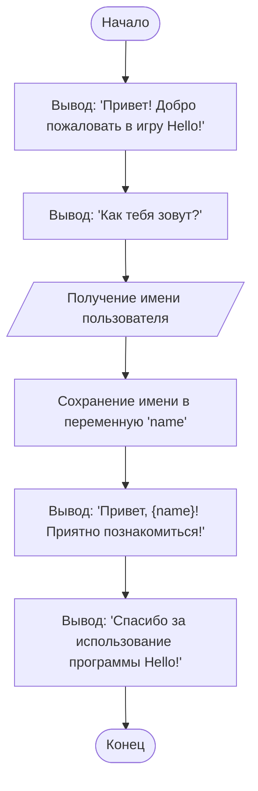

```python
# Игра Hello
# Эта программа выводит приветствие пользователю.
# Это одна из самых простых программ, которая демонстрирует базовые команды Python.

# Вывод приветствия на экран
print("Привет! Добро пожаловать в игру Hello!")  # Используется функцию print для вывода текста

# Запрос имени пользователя
name = input("Как тебя зовут? ")  # Используется функцию input для получения данных от пользователя

# Вывод персонализированного приветствия
print(f"Привет, {name}! Приятно познакомиться!")  # Используется f-строку для подстановки имени в текст

# Дополнительное сообщение
print("Спасибо за использование программы Hello!")
```

---

### **Пояснения к коду:**
1. **`print()`** – Функция для вывода текста на экран. В данном случае используется для приветствия пользователя.
2. **`input()`** – Функция для получения данных от пользователя. В данном случае запрашивается имя.
3. **f-строки** – Используются для подстановки переменных в строку. Например, `{name}` подставляет значение переменной `name`.
4. **Переменная `name`** – Хранит имя, введённое пользователем.

---

### **Как работает программа:**
1. Программа выводит приветствие.
2. Запрашивает у пользователя его имя.
3. Выводит персонализированное приветствие, используя введённое имя.
4. Завершает работу с дополнительным сообщением.

---

### **Пример выполнения программы:**
```
Привет! Добро пожаловать в игру Hello!
Как тебя зовут? Иван
Привет, Иван! Приятно познакомиться!
Спасибо за использование программы Hello!
```
### **Блок-схема**


Легенда
1. **`Start`** – Начало программы.
2. **`DisplayWelcome`** – Вывод приветствия пользователю.
3. **`AskName`** – Вывод запроса имени пользователя.
4. **`GetUserName`** – Получение имени от пользователя.
5. **`StoreName`** – Сохранение имени в переменную `name`.
6. **`DisplayGreeting`** – Вывод персонализированного приветствия с использованием переменной `name`.
7. **`DisplayThanks`** – Вывод сообщения о завершении программы.
8. **`End`** – Конец программы.

Запустить код в [google colab](https://colab.research.google.com/github/hypo69/101_python_computer_games_ru/blob/master/GAMES/HELLO/101bcg_ru_hello.ipynb)


### В эпоху AI код тоже должен соответствовать времени. Посмотри современную версию Hello, World!

В прошлом посте я начал показывать простые решения для начинающих изучать Python. Как и во всех учебниках программирования, я начал с классического примера "Hello, World!". В ней главный акцент я поставил не на коде, а на комментариях. Не ленись писать комментарии. Не надейся на свою память. С ростом сложности кода ты обязательно забудешь, что писал на прошлой неделе или месяц назад. Твой код кто-то будет читать, а хорошо задокументированный код читается как приключенческий роман. Плохо задокументированный код, с непонятными именами переменных и функций, с запутанной логикой сразу хочется выбросить в помойку.

В эпоху AI код тоже должен соответствовать времени. Посмотри современную версию Hello, World! — интерактивный пример, который позволяет взаимодействовать с моделью искусственного интеллекта Gemini от Google. Этот пример показывает, как можно использовать Python для общения с AI и получения ответов на свои вопросы.

