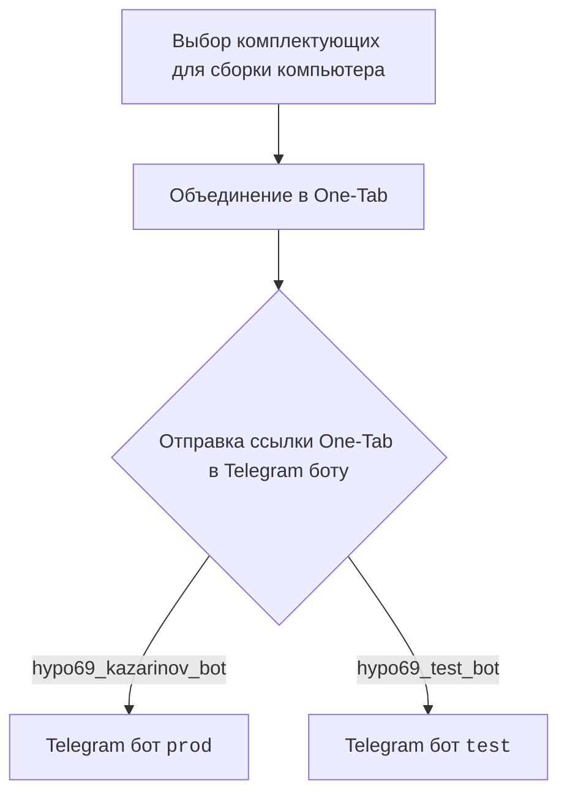
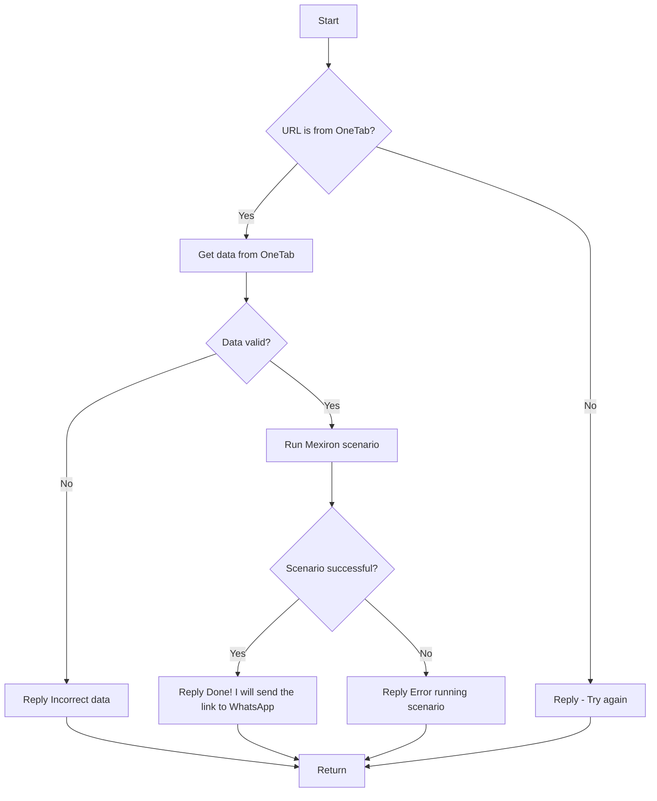

```rst
.. module:: src.endpoints.kazarinov
	.. synopsys: Казаринов. Мехирон в pdf 
```

<TABLE >
<TR>
<TD>
<A HREF = 'https://github.com/hypo69/hypotez/blob/master/README.MD'>[Root ↑]</A>
</TD>
<TD>
<A HREF = 'https://github.com/hypo69/hypotez/blob/master/src/endpoints/kazarinov/README.MD'>English</A>
</TD>
</TR>
</TABLE>

Создание прайслиста для Казаринова
========================================

`KazarinovTelegramBot`
- https://one-tab.co.il
- https://morlevi.co.il
- https://grandavance.co.il
- https://ivory.co.il
- https://ksp.co.il 
-------- 
`BotHandler` 

На стороне клиента: 

На стороне кода: 

 - `kazarinov_bot.handle_message()` -> `kazarinov.scenarios.run_scenario()`:


Далее
=========
<A HREF = 'https://github.com/hypo69/hypotez/blob/master/src/endpoints/kazarinov/kazarinov_bot.ru.md'>Казарионв бот</A>
<br>
<A HREF = 'https://github.com/hypo69/hypotez/blob/master/src/endpoints/kazarinov/scenarios/readme.ru.md'>Испоолнение сценария</A>