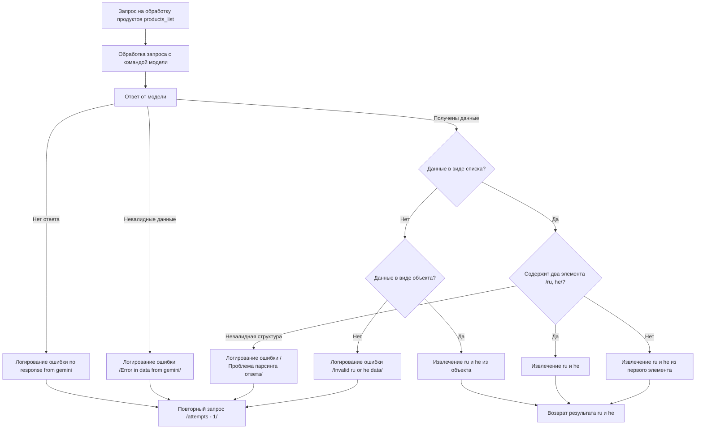

```mermaid
flowchart TD
    A[Запрос на обработку продуктов products_list] --> B[Обработка запроса с командой модели]
    B --> C[Ответ от модели]
    
    %% Проверка на отсутствие ответа
    C -->|Нет ответа| D[Логирование ошибки no response from gemini]
    D --> E[Повторный запрос /attempts - 1/]

    %% Проверка на валидность данных
    C -->|Невалидные данные| F[Логирование ошибки /Error in data from gemini/]
    F --> E

    %% Проверка на полученные данные
    C -->|Получены данные| G{Данные в виде списка?}
    G -->|Да| H{Содержит два элемента /ru, he/?}
    H -->|Да| I[Извлечение ru и he]
    H -->|Нет| J[Извлечение ru и he из первого элемента]
    H -->|Невалидная структура| K[Логирование ошибки /Проблема парсинга ответа/]
    K --> E

    G -->|Нет| L{Данные в виде объекта?}
    L -->|Да| M[Извлечение ru и he из объекта]
    L -->|Нет| N[Логирование ошибки /Invalid ru or he data/]
    N --> E

    %% Возврат результата
    M --> O[Возврат результата ru и he]
    I --> O
    J --> O


```