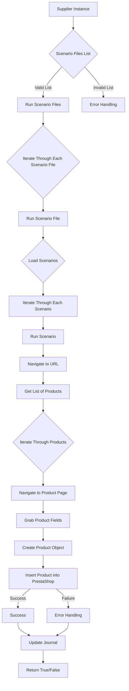

# Module `src.scenario`

## Overview

The `src.scenario` module is designed to automate interactions with suppliers using scenarios described in JSON files. It streamlines the process of extracting and processing product data from supplier websites and synchronizing this information with a database (e.g., PrestaShop). The module includes functionality for reading scenarios, interacting with websites, processing data, logging execution details, and organizing the entire workflow.

## Table of Contents

* [Module `src.scenario`](#module-src-scenario)
* [Overview](#overview)
* [Core Functions of the Module](#core-functions-of-the-module)
* [Main Components of the Module](#main-components-of-the-module)
    * [`run_scenario_files(s, scenario_files_list)`](#run_scenario_files-s-scenario_files_list)
    * [`run_scenario_file(s, scenario_file)`](#run_scenario_file-s-scenario_file)
    * [`run_scenario(s, scenario)`](#run_scenario-s-scenario)
    * [`dump_journal(s, journal)`](#dump_journal-s-journal)
    * [`main()`](#main)
* [Example Scenario](#example-scenario)
* [How It Works](#how-it-works)

## Core Functions of the Module

1. **Reading Scenarios**: Loading scenarios from JSON files containing product information and URLs on the supplier's website.
2. **Interacting with Websites**: Processing URLs from scenarios to extract product data.
3. **Processing Data**: Transforming extracted data into a format suitable for the database and saving it.
4. **Logging Execution**: Maintaining logs with details of scenario execution and results for tracking progress and identifying errors.




## Main Components of the Module

### `run_scenario_files(s, scenario_files_list)`

**Description**: Accepts a list of scenario files and executes them sequentially by invoking the `run_scenario_file` function for each file.

**Parameters**:
- `s`: A settings object (e.g., for database connection).
- `scenario_files_list` (list): A list of paths to scenario files.

**Returns**:
- None

**Raises**:
- `FileNotFoundError`: If a scenario file is not found.
- `JSONDecodeError`: If a scenario file contains invalid JSON.

### `run_scenario_file(s, scenario_file)`

**Description**: Loads scenarios from the specified file and calls `run_scenario` for each scenario in the file.

**Parameters**:
- `s`: A settings object.
- `scenario_file` (str): Path to the scenario file.

**Returns**:
- None

**Raises**:
- `FileNotFoundError`: If the scenario file is not found.
- `JSONDecodeError`: If the scenario file contains invalid JSON.
- `Exception`: For any other issues during scenario execution.

### `run_scenario(s, scenario)`

**Description**: Processes an individual scenario by navigating to a URL, extracting product data, and saving it to the database.

**Parameters**:
- `s`: A settings object.
- `scenario` (dict): A dictionary containing the scenario (e.g., with URL and categories).

**Returns**:
- None

**Raises**:
- `requests.exceptions.RequestException`: If there are issues with the website request.
- `Exception`: For any other problems during scenario processing.

### `dump_journal(s, journal)`

**Description**: Saves the execution journal to a file for subsequent analysis.

**Parameters**:
- `s`: A settings object.
- `journal` (list): A list of execution log entries.

**Returns**:
- None

**Raises**:
- `Exception`: If there are issues writing to the file.

### `main()`

**Description**: The main function to launch the module.

**Parameters**:
- None

**Returns**:
- None

**Raises**:
- `Exception`: For any critical errors during execution.

## Example Scenario

An example JSON scenario describes interactions with product categories on a website. It includes a URL, the category name, and category identifiers in the PrestaShop database.

```json
{
    "scenarios": {
        "mineral+creams": {
            "url": "https://example.com/category/mineral-creams/",
            "name": "mineral+creams",
            "presta_categories": {
                "default_category": 12345,
                "additional_categories": [12346, 12347]
            }
        }
    }
}
