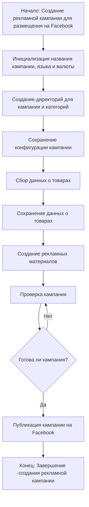

### `campaign`  
**Описание**:  
Модуль `campaign` предназначен для управления процессом создания и публикации 
рекламных кампаний на Фейсбук. 
Он включает функционал для инициализации параметров кампании (название, язык, валюта), 
создания структуры директорий, сохранения конфигураций для новой кампании, 
сбора и сохранения данных о товарах через `ali` или `html`, 
генерации рекламных материалов, проверки кампании и публикации ее на Facebook.

