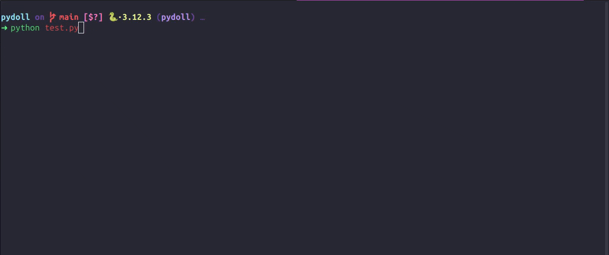
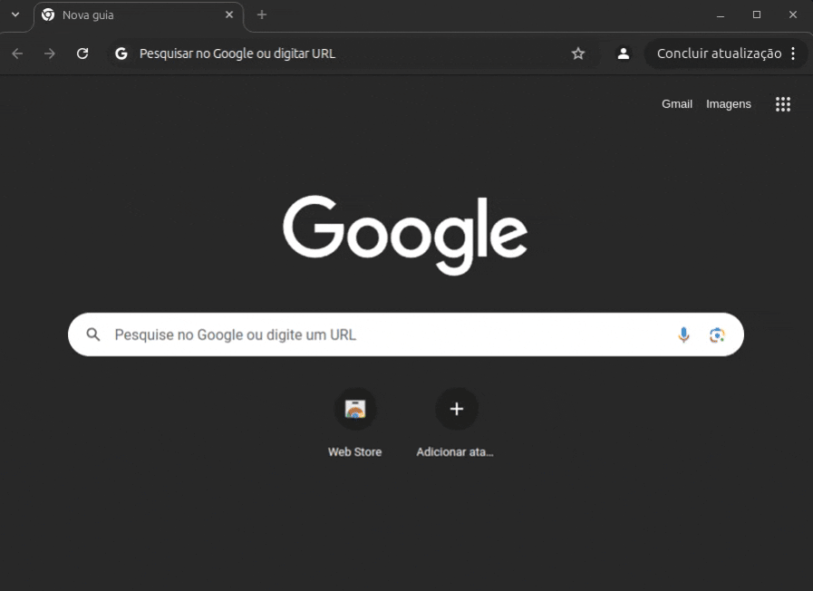
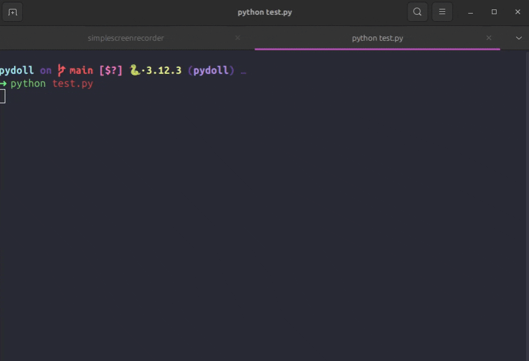

<p align="center">
     <br>
</p>
<h1 align="center">Pydoll: Automate the Web, Naturally</h1>

<p align="center">
    <a href="https://codecov.io/gh/autoscrape-labs/pydoll" >
        
    </a>
    
    
    
    = 3.10">
    <a href="https://deepwiki.com/autoscrape-labs/pydoll"></a>
</p>


<p align="center">
  📖 <a href="https://autoscrape-labs.github.io/pydoll/">文档</a> •
  🚀 <a href="#getting-started">快速上手</a> •
  ⚡ <a href="#advanced-features">高级特性</a> •
  🤝 <a href="#contributing">贡献</a> •
  💖 <a href="#support-my-work">赞助我</a>
</p>

- [English](README.md)

设想以下场景：你需要实现浏览器任务的自动化操作——无论是测试Web应用程序、从网站采集数据，还是批量处理重复性流程。传统方法往往需要配置外部驱动程序、进行复杂的系统设置，还可能面临诸多兼容性问题。

**Pydoll的诞生就是解决这些问题!!!**

Pydoll 采用全新设计理念，从零构建，直接对接 Chrome DevTools Protocol（CDP），无需依赖外部驱动。 这种精简的实现方式，结合高度拟真的点击、导航及元素交互机制，使其行为与真实用户几乎毫无区别。

我们坚信，真正强大的自动化工具，不应让用户困于繁琐的配置学习，也不该让用户疲于应对反爬系统的风控。使用Pydoll，你只需专注核心业务逻辑——让自动化回归本质，而非纠缠于底层技术细节或防护机制。


## 🌟 Pydoll 的核心优势
- **零 WebDriver 依赖**：彻底告别驱动兼容性烦恼
- **原生验证码绕过**：轻松应对 Cloudflare Turnstile 和 reCAPTCHA v3*
- **异步高性能**：支持高速自动化与多任务并行处理
- **拟真交互体验**：完美复刻真实用户行为模式
- **极简部署**：安装即用，开箱即自动化
>⚠️ *验证码绕过效果受IP纯净度等因素影响。Pydoll可实现接近真实用户的评分，但无法突破严格防护策略或IP风控。

## 安装

```bash
pip install pydoll-python
```

就这么简单！安装即用，马上开始自动化

## 🚀 快速上手

### 你的第一个自动化任务

让我们从一个实际例子开始：一个自动执行谷歌搜索并点击第一个结果的自动化流程。通过这个示例，你可以了解该库的工作原理，以及如何开始将日常任务自动化。

```python
import asyncio

from src.webdriver.pydoll.llib.pydoll.browser import Chrome
from src.webdriver.pydoll.llib.pydoll.constants import Key

async def google_search(query: str):
    async with Chrome() as browser:
        tab = await browser.start()
        await tab.go_to('https://www.google.com')
        search_box = await tab.find(tag_name='textarea', name='q')
        await search_box.insert_text(query)
        await search_box.press_keyboard_key(Key.ENTER)
        await (await tab.find(
            tag_name='h3',
            text='autoscrape-labs/pydoll',
            timeout=10,
        )).click()
        await tab.find(id='repository-container-header', timeout=10)

asyncio.run(google_search('pydoll python'))
```

无需任何配置，只需一个简单脚本，我们就能完成一次完整的谷歌搜索！
好了，现在让我们看看如何从网页中提取数据，依然沿用之前的示例。

假设在以下代码中，我们已经进入了 Pydoll 项目页面。我们需要提取以下信息：

- 项目描述
- 星标数量
- Fork 数量
- Issue 数量
- Pull Request 数量
如果想要获取项目描述，我们将使用 XPath 查询。你可以查阅相关文档，学习如何构建自己的查询语句。

```python
description = await (await tab.query(
    '//h2[contains(text(), "About")]/following-sibling::p',
    timeout=10,
)).text
```

下面让我们来理解这条查询语句的作用：

1. `//h2[contains(text(), "About")]` - 选择第一个包含"About"的 `<h2>` 标签
2. `/following-sibling::p` - 选择第一个在`<h2>` 标签之后的`<p>`标签

然后你可以获取到剩下的数据：

```python
number_of_stars = await (await tab.find(
    id='repo-stars-counter-star'
)).text

number_of_forks = await (await tab.find(
    id='repo-network-counter'
)).text
number_of_issues = await (await tab.find(
    id='issues-repo-tab-count',
)).text
number_of_pull_requests = await (await tab.find(
    id='pull-requests-repo-tab-count',
)).text

data = {
    'description': description,
    'number_of_stars': number_of_stars,
    'number_of_forks': number_of_forks,
    'number_of_issues': number_of_issues,
    'number_of_pull_requests': number_of_pull_requests,
}
print(data)

```

下图展示了本次自动化任务的执行速度与结果。
（为演示需要，浏览器界面未显示。）




短短5秒内，我们就成功提取了所需数据！  
这就是使用Pydoll进行自动化所能达到的速度。

### 更多复杂的例子

接下来我们来看一个你可能经常遇到的场景：类似Cloudflare的验证码防护。  
Pydoll提供了相应的处理方法，但需要说明的是，正如前文所述，其有效性会受到多种因素影响。  
下面的代码展示了一个完整的Cloudflare验证码处理示例。

```python
import asyncio

from src.webdriver.pydoll.llib.pydoll.browser import Chrome
from src.webdriver.pydoll.llib.pydoll.constants import By

async def cloudflare_example():
    async with Chrome() as browser:
        tab = await browser.start()
        async with tab.expect_and_bypass_cloudflare_captcha():
            await tab.go_to('https://2captcha.com/demo/cloudflare-turnstile')
        print('Captcha handled, continuing...')
        await asyncio.sleep(5)  # just to see the result :)

asyncio.run(cloudflare_example())

```

执行结果如下：




仅需数行代码，我们就成功攻克了最棘手的验证码防护之一。
而这仅仅是Pydoll所提供的众多强大功能之一。但这还远不是全部！


### 自定义配置

有时我们需要对浏览器进行更精细的控制。Pydoll提供了灵活的配置方式来实现这一点。下面我们来看具体示例：


```python
from src.webdriver.pydoll.llib.pydoll.browser import Chrome
from src.webdriver.pydoll.llib.pydoll.browser.options import ChromiumOptions as Options

async def custom_automation():
    # Configure browser options
    options = Options()
    options.add_argument('--proxy-server=username:password@ip:port')
    options.add_argument('--window-size=1920,1080')
    options.binary_location = '/path/to/your/browser'

    async with Chrome(options=options) as browser:
        tab = await browser.start()
        # Your automation code here
        await tab.go_to('https://example.com')
        # The browser is now using your custom settings

asyncio.run(custom_automation())
```

本示例中，我们配置浏览器使用代理服务器，并设置窗口分辨率为1920x1080。此外，还指定了Chrome二进制文件的自定义路径——适用于您的安装位置与常规默认路径不同的情况。

## ⚡ 
高级功能

Pydoll提供了一系列高级特性满足高端玩家的需求。


### 高级元素定位

我们提供多种页面元素定位方式。无论您偏好那种方法，都能找到适合您的解决方案：

```python
import asyncio
from src.webdriver.pydoll.llib.pydoll.browser import Chrome

async def element_finding_examples():
    async with Chrome() as browser:
        tab = await browser.start()
        await tab.go_to('https://example.com')

        # Find by attributes (most intuitive)
        submit_btn = await tab.find(
            tag_name='button',
            class_name='btn-primary',
            text='Submit'
        )
        # Find by ID
        username_field = await tab.find(id='username')
        # Find multiple elements
        all_links = await tab.find(tag_name='a', find_all=True)
        # CSS selectors and XPath
        nav_menu = await tab.query('nav.main-menu')
        specific_item = await tab.query('//div[@data-testid="item-123"]')
        # With timeout and error handling
        delayed_element = await tab.find(
            class_name='dynamic-content',
            timeout=10,
            raise_exc=False  # Returns None if not found
        )
        # Advanced: Custom attributes
        custom_element = await tab.find(
            data_testid='submit-button',
            aria_label='Submit form'
        )

asyncio.run(element_finding_examples())
```

find 方法更为友好。我们可以通过常见属性（如 id、tag_name、class_name 等）进行元素查找，甚至支持自定义属性（例如 data-testid）。

如果这些基础方式仍不能满足需求，还可使用 query 方法，通过 CSS 选择器、XPath 查询语句等多种方式进行元素定位。Pydoll 会自动识别当前使用的查询类型。

### 并发自动化

Pydoll 的一大优势在于其基于异步实现的多任务并行处理能力。我们可以同时自动化操作多个浏览器标签页！下面来看具体示例：

```python
import asyncio
from src.webdriver.pydoll.llib.pydoll.browser import Chrome

async def scrape_page(url, tab):
    await tab.go_to(url)
    title = await tab.execute_script('return document.title')
    links = await tab.find(tag_name='a', find_all=True)
    return {
        'url': url,
        'title': title,
        'link_count': len(links)
    }

async def concurrent_scraping():
    browser = Chrome()
    tab_google = await browser.start()
    tab_duckduckgo = await browser.new_tab()
    tasks = [
        scrape_page('https://google.com/', tab_google),
        scrape_page('https://duckduckgo.com/', tab_duckduckgo)
    ]
    results = await asyncio.gather(*tasks)
    print(results)
    await browser.stop()

asyncio.run(concurrent_scraping())
```

下方展示令人惊叹的执行速度：




这个例子,我们成功实现了同时对两个页面的数据提取.
还有更多强大功能！响应式自动化的事件系统、请求拦截与修改等等。赶快查阅文档!

## 🔧 常用问题

**找不到浏览器?**
```python
from src.webdriver.pydoll.llib.pydoll.browser import Chrome
from src.webdriver.pydoll.llib.pydoll.browser.options import ChromiumOptions

options = ChromiumOptions()
options.binary_location = '/path/to/your/chrome'
browser = Chrome(options=options)
```

**需要代理?**
```python
options.add_argument('--proxy-server=your-proxy:port')
```

**在docker中运行?**
```python
options.add_argument('--no-sandbox')
options.add_argument('--disable-dev-shm-usage')
```

## 📚 文档

Pydoll 的完整文档、详细示例以及对所有功能的深入探讨可以通过以下链接访问： [官方文档](https://autoscrape-labs.github.io/pydoll/).

文档包含以下部分:
- **快速上手** - 手把手带你上手Pydoll
- **API参考** - 完整的方法文档说明  
- **高级技巧** - 网络请求拦截、事件处理、性能优化  

## 🤝 贡献

我们诚挚邀请您参与改进Pydoll！请查阅我们的贡献指南了解如何开始贡献。无论是修复bug、添加新功能还是完善文档——所有贡献都备受欢迎！

请务必注意：

- 为新功能或bug修复编写测试用例
- 遵循代码风格和规范
- 使用约定式提交规范提交Pull Request
- 在提交前运行lint检查和测试

## 💖 赞助我们

如果你觉得本项目对你有帮助，可以考虑[赞助我们](https://github.com/sponsors/thalissonvs).  
您将获取独家优先支持,定制需求以及更多的福利!

现在不能赞助?无妨,你可以通过以下方式支持我们:
- ⭐ Star 本项目
- 📢 社交平台分享
- ✍️ 撰写教程或博文
- 🐛 反馈建议或提交issues

点滴相助，铭记于心——诚谢！  

## 许可

Pydoll是在 [MIT License](LICENSE) 许可下许可的开源软件。  

<p align="center">
  <b>Pydoll</b> — Making browser automation magical!
</p>
