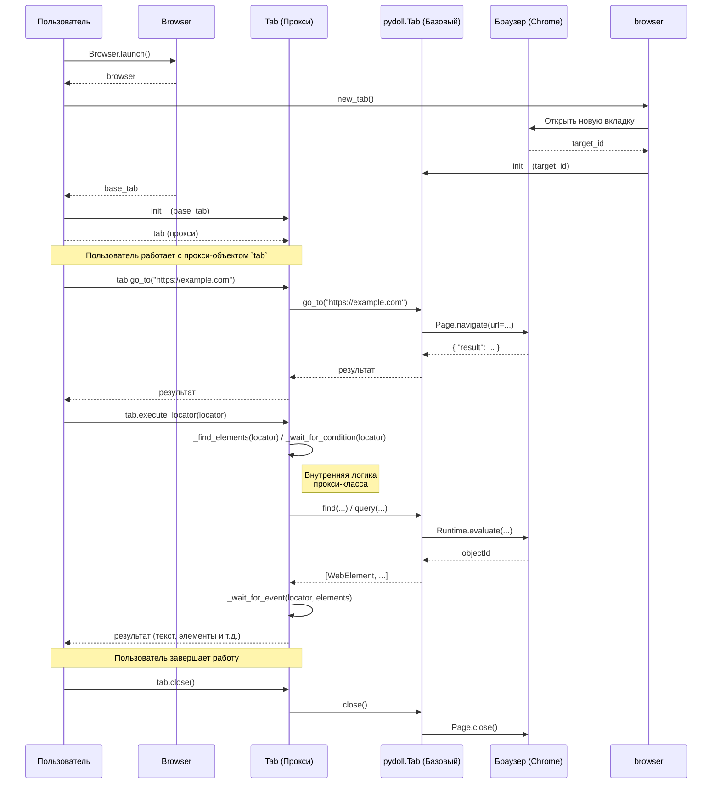

# Pydoll: асинхронная веб-автоматизация на Python

Pydoll — это мощная библиотека Python для автоматизации браузеров на базе Chromium. Она предлагает современный, асинхронный подход к веб-скрапингу и автоматизации, устраняя необходимость в традиционных веб-драйверах.

## Ключевые особенности

*   **Архитектура без WebDriver:** Pydoll напрямую взаимодействует с браузерами, такими как Chrome и Edge, используя протокол DevTools. Это означает, что вам не нужно управлять исполняемыми файлами WebDriver (например, `chromedriver.exe`), что упрощает настройку и позволяет избежать проблем с совместимостью версий.
*   **Асинхронность по своей природе:** Pydoll, созданный на основе библиотеки `asyncio` в Python, может выполнять несколько операций одновременно. Это обеспечивает значительный прирост производительности, особенно при работе с несколькими вкладками или сборе данных с многочисленных страниц одновременно.
*   **Человекоподобные взаимодействия:** Чтобы избежать обнаружения в качестве бота, Pydoll имитирует реалистичное поведение пользователя. Он может имитировать человекоподобные движения мыши, скорость набора текста и вводить случайные задержки.
*   **Встроенный обход Cloudflare:** Pydoll включает функции для автоматической обработки и обхода защиты от ботов Cloudflare, включая Turnstile и reCAPTCHA v3.
*   **Расширенный выбор элементов:** Вы можете находить элементы на странице, используя различные стратегии, в том числе:
    *   Простые атрибуты (ID, имя класса, имя тега)
    *   CSS-селекторы
    *   Запросы XPath
*   **Интеграция с прокси:** Легко настройте Pydoll для использования прокси для ротации IP-адресов, что необходимо для крупномасштабного скрапинга и предотвращения блокировки по IP.
*   **Всесторонний контроль:** Pydoll предоставляет богатый API для детального управления браузером, включая:
    *   Создание скриншотов и экспорт страниц в PDF
    *   Перехват и изменение сетевых запросов
    *   Автоматизация загрузки файлов
    *   Выполнение пользовательского кода JavaScript

## Установка

Чтобы начать использовать Pydoll, установите его через pip:

```bash
pip install pydoll-python
```

## Начало работы: простой пример

Вот базовый скрипт, который открывает Google, ищет «pydoll python» и ждет загрузки результатов:

```python
import asyncio
from pydoll.browser.chrome import Chrome
from pydoll.constants import Key

async def main():
    async with Chrome() as browser:
        # Запустите браузер и получите новую вкладку
        tab = await browser.start()

        # Перейдите в Google
        await tab.go_to('https://www.google.com')

        # Найдите поле поиска по его атрибутам
        search_box = await tab.find(tag_name='textarea', name='q')

        # Введите поисковый запрос и нажмите Enter
        await search_box.insert_text('pydoll python')
        await search_box.press_keyboard_key(Key.ENTER)

        # Дождитесь появления результатов поиска
        await tab.wait_element(id='search')

        print("Результаты поиска загружены!")

# Запустите асинхронную основную функцию
asyncio.run(main())
```

## Взаимодействие с веб-элементами

Объект `tab` — ваш основной инструмент для взаимодействия с веб-страницей. Он работает аналогично `WebDriver` в Selenium, но с асинхронными методами.

### Поиск элементов

*   **`tab.find(...)`:** Находит первый элемент, соответствующий заданным критериям.
*   **`tab.find_elements(...)`:** Находит все элементы, соответствующие критериям.
*   **`tab.query(...)`:** Находит элементы с помощью селекторов CSS или запросов XPath.
*   **`tab.wait_element(...)`:** Ожидает, пока элемент станет доступен на странице, прежде чем вернуть его.

### Действия с элементами

Получив элемент, вы можете с ним взаимодействовать:

*   **`element.click()`:** Нажимает на элемент.
*   **`element.insert_text('...')`:** Вводит текст в поле ввода.
*   **`element.text`:** Получает текстовое содержимое элемента.
*   **`element.press_keyboard_key(...)`:** Имитирует нажатие клавиши на клавиатуре.

## Обработка Cloudflare

Pydoll предоставляет два основных подхода для работы с мерами защиты от ботов Cloudflare:

### 1. Менеджер контекста (синхронная обработка)

Этот подход приостановит выполнение вашего скрипта до тех пор, пока не будет решена задача Cloudflare.

```python
async with tab.expect_and_bypass_cloudflare_captcha():
    await tab.go_to('https://www.example.com')
```

### 2. Фоновая обработка (асинхронная обработка)

Этот метод позволяет вашему скрипту продолжать выполнять другие задачи, пока Pydoll обрабатывает задачу Cloudflare в фоновом режиме.

```python
# Включить автоматическое решение Cloudflare
await tab.enable_auto_solve_cloudflare_captcha()

# Перейдите на страницу
await tab.go_to('https://www.example.com')

# Продолжайте выполнять другие задачи...

# Отключите эту функцию, когда она больше не нужна
await tab.disable_auto_solve_cloudflare_captcha()
```

## Ограничения, которые следует учитывать

*   **Ограничение скорости:** Хотя Pydoll может помочь вам избежать обнаружения, отправка слишком большого количества запросов за короткий период все равно может привести к блокировке вашего IP-адреса. Важно реализовывать задержки и использовать прокси для крупномасштабного скрапинга.
*   **Сложность CAPTCHA:** Автоматический обход Pydoll работает для многих, но не для всех типов CAPTCHA. Более сложные задачи могут потребовать ручного вмешательства или сторонних сервисов для их решения.
*   **Совместимость с браузерами:** Pydoll специально разработан для браузеров на базе Chromium (таких как Chrome и Edge). Он не будет работать с другими браузерами, такими как Firefox или Safari.


Вот несколько диаграмм, которые показывают работу `Tab` с разных сторон: от общего взаимодействия до детального процесса поиска элемента.

### 1. Общая диаграмма взаимодействия (Sequence Diagram)

Эта диаграмма показывает типичный жизненный цикл работы с `Tab` и его взаимодействие с другими компонентами.



### 2. Детальная диаграмма работы `execute_locator` (Flowchart)

Эта диаграмма показывает по шагам, что происходит внутри самого важного метода вашего прокси-класса.

Понял. Эта ошибка (`Expecting ..., got 'PS'`) — классический признак того, что парсер не справляется с двоеточием (`:`) внутри метки узла. Это довольно распространенное ограничение в старых или строгих реализациях Mermaid.

Давайте полностью переработаем синтаксис, чтобы сделать его максимально "безопасным" и совместимым. Мы уберем все потенциально проблемные символы из меток.

### Исправленная и упрощенная диаграмма (версия 3)

```mermaid
graph TD
    subgraph execute_locator
        A["Start execute_locator(locator)"] --> B{"Has multiple selectors 'semicolon'?"};
        B --"Yes"--> C["Split into multiple selectors"];
        B --"No"--> D["Use single selector"];
        C --> E["Loop through selectors"];
        D --> F["Process selector"];
        E --> F;
        
        F --> G{"Wait for condition?"};
        G --"Yes"--> H["Call _wait_for_condition"];
        G --"No"--> I["Call _find_elements"];
        H --> J["Get elements list"];
        I --> J;
        
        J --> K{"Elements found?"};
        K --"Yes"--> L{"Is 'find_first_match' and more selectors to check?"};
        K --"No"--> M{"More selectors to check?"};
        
        M --"Yes"--> E;
        M --"No"--> N["Return False if mandatory"];
        
        L --"Yes"--> O{"Execute event?"};
        L --"No"--> O;
        
        O --"Yes"--> P["Call _wait_for_event"];
        O --"No"--> Q{"Extract attribute?"};
        P --> Q;
        
        Q --"Yes"--> R["Extract attribute value"];
        Q --"No"--> S["Return list of WebElements"];
        
        R --> T{"Apply list filter 'if_list'?"};
        S --> T;
        
        T --"Yes"--> U["Filter the result list"];
        T --"No"--> V["Return result as is"];
        
        U --> W["End - return filtered result"];
        V --> W;
        N --> W;
    end
```




### 3. Диаграмма наследования и композиции (Class Diagram)

Эта диаграмма показывает, как ваши классы связаны друг с другом и с миксином.
```mermaid
classDiagram
    direction LR

    class FindElementsMixin {
        <<Mixin>>
        +find(..)
        +query(..)
    }

    class BaseTab {
        <<pydoll.tab.Tab>>
        +go_to(url)
        +close()
        +execute_script(script)
    }
    BaseTab --|> FindElementsMixin : inherits

    class WebElement {
        +click()
        +type_text(text)
    }
    WebElement --|> FindElementsMixin : inherits

    class TabProxy {
        <<Proxy>>
        - _base_tab: BaseTab
        +execute_locator(locator)
        +__aenter__()
        +__aexit__()
    }

    TabProxy o-- BaseTab : contains/proxies
    
    note "Implements __getattr__ to<br>forward calls to BaseTab" as N1
    TabProxy .. N1
```

### Как использовать эти диаграммы:

1.  **Скопируйте код:** Возьмите код, заключенный в ```mermaid ... ```.
2.  **Вставьте в редактор:** Вставьте его в любой онлайн-редактор Mermaid (например, [Mermaid Live Editor](https://mermaid.live/)) или в ваш `README.md` на платформах, которые это поддерживают (GitHub, GitLab и др.).

Эти диаграммы помогут вам и вашим коллегам быстро понять архитектуру и логику работы вашего кода.