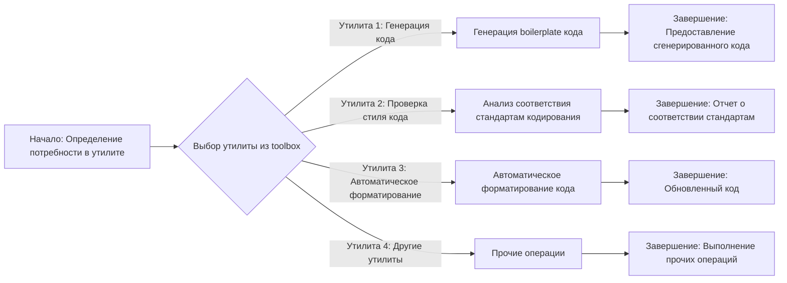
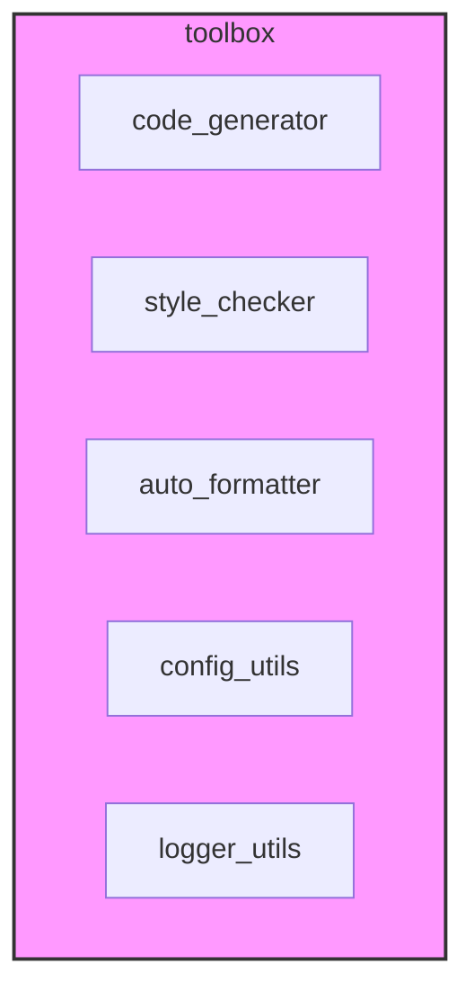

### Анализ кода проекта `hypotez`

=========================================================================================

**Расположение файла в проекте:** `hypotez/toolbox/README.MD`

**Замечание:** Предоставленный код не является исполняемым кодом Python, а скорее текстовым описанием. Поэтому я буду интерпретировать его как запрос на анализ предполагаемой функциональности модуля `toolbox` в проекте `hypotez`.

---

### 1. Блок-схема

Блок-схема описывает предполагаемую функциональность раздела `toolbox`, как набор вспомогательных утилит для разработчиков в проекте `hypotez`.

**Пояснения:**

1.  **Начало: Определение потребности в утилите**: Разработчик определяет необходимость в использовании утилиты из `toolbox`. Например, нужно сгенерировать шаблон класса или проверить стиль кода.
2.  **Выбор утилиты из toolbox**: Выбор конкретной утилиты в зависимости от потребности.
    *   **Утилита 1: Генерация кода**: Генерация начального кода (boilerplate).
        *   Пример: Генерация класса с базовыми методами на основе заданной структуры данных.
    *   **Утилита 2: Проверка стиля кода**: Проверка соответствия кода стандартам кодирования (PEP8, и т.д.).
        *   Пример: Проверка наличия пробелов вокруг операторов, соответствия длины строк, и т.д.
    *   **Утилита 3: Автоматическое форматирование**: Автоматическое приведение кода к заданному стилю.
        *   Пример: Автоматическое добавление пробелов, перенос длинных строк, сортировка импортов.
    *   **Утилита 4: Другие утилиты**: Различные вспомогательные утилиты.
        *   Пример: Инструменты для работы с конфигурационными файлами, утилиты для логирования, и т.д.
3.  **Завершение**: Результат работы утилиты.
    *   **Предоставление сгенерированного кода**: Сгенерированный код предоставляется разработчику.
    *   **Отчет о соответствии стандартам**: Отчет о найденных несоответствиях стилю кода.
    *   **Обновленный код**: Код, автоматически отформатированный в соответствии со стандартами.
    *   **Выполнение прочих операций**: Результат работы прочих утилит.

---

### 2. Диаграмма

На основе предоставленного описания, сложно построить полноценную диаграмму зависимостей. Однако, можно представить структуру модуля `toolbox` в виде компонентной диаграммы.

**Пояснения:**

*   `code_generator`: Утилиты для генерации boilerplate кода.
*   `style_checker`: Утилиты для проверки стиля кода.
*   `auto_formatter`: Утилиты для автоматического форматирования кода.
*   `config_utils`: Утилиты для работы с конфигурационными файлами.
*   `logger_utils`: Утилиты для упрощения логирования.

**Зависимости:**

Невозможно определить зависимости без анализа реального кода.

---

### 3. Объяснение

**Общее:**

Раздел `toolbox` предназначен для предоставления набора утилит, упрощающих процесс разработки в проекте `hypotez`.  Он содержит инструменты для генерации кода, проверки стиля, автоматического форматирования, работы с конфигурацией и логированием.

**Предполагаемые компоненты:**

*   **code_generator**:
    *   **Функциональность**: Генерация boilerplate кода на основе шаблонов или описаний.
    *   **Пример**: Генерация класса для работы с данными, на основе схемы данных.
*   **style_checker**:
    *   **Функциональность**: Проверка соответствия кода стандартам кодирования (PEP8).
    *   **Пример**: Проверка длины строк, наличия пробелов, правильности именования переменных и функций.
*   **auto_formatter**:
    *   **Функциональность**: Автоматическое форматирование кода в соответствии со стандартами.
    *   **Пример**: Автоматическая расстановка пробелов, перенос длинных строк, сортировка импортов.
*   **config_utils**:
    *   **Функциональность**: Упрощение работы с конфигурационными файлами (чтение, запись, валидация).
    *   **Пример**: Загрузка конфигурации из JSON/YAML файла, проверка наличия необходимых параметров.
*   **logger_utils**:
    *   **Функциональность**: Предоставление удобного интерфейса для логирования.
    *   **Пример**: Обертки для стандартного модуля `logging`, упрощающие запись логов в файл или консоль.

**Потенциальные ошибки и области для улучшения:**

*   **Недостаточная документация**: Отсутствие подробной документации для каждой утилиты может затруднить их использование.
*   **Отсутствие тестов**: Необходимы тесты для каждой утилиты, чтобы гарантировать их корректную работу.
*   **Зависимости**: Необходимо следить за зависимостями между утилитами, чтобы избежать конфликтов.
*   **Гибкость**: Утилиты должны быть достаточно гибкими, чтобы их можно было использовать в различных сценариях.

**Взаимосвязь с другими частями проекта:**

`toolbox` может использоваться различными частями проекта `hypotez` для упрощения разработки, автоматизации рутинных задач и обеспечения соответствия кода стандартам. Например, утилиты `config_utils` могут использоваться для загрузки конфигурации в различных модулях проекта, а `logger_utils` для логирования событий.