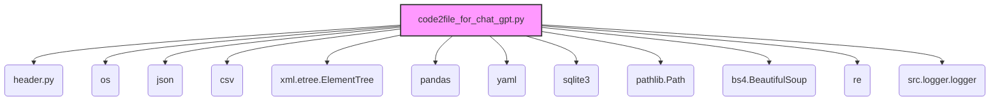
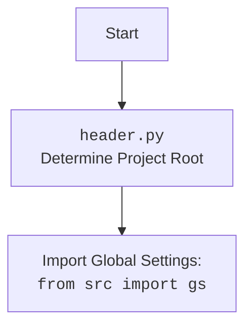

### **Системные инструкции для обработки кода проекта `hypotez`**

=========================================================================================

Описание функциональности и правил для генерации, анализа и улучшения кода. Направлено на обеспечение последовательного и читаемого стиля кодирования, соответствующего требованиям.

---

### **Основные принципы**

#### **1. Общие указания**:
- Соблюдай четкий и понятный стиль кодирования.
- Все изменения должны быть обоснованы и соответствовать установленным требованиям.

#### **2. Комментарии**:
- Используй `#` для внутренних комментариев.
- Документация всех функций, методов и классов должна следовать такому формату: 
    ```python
        def function(param: str, param1: Optional[str | dict | str] = None) -> dict | None:
            """ 
            Args:
                param (str): Описание параметра `param`.
                param1 (Optional[str | dict | str], optional): Описание параметра `param1`. По умолчанию `None`.
    
            Returns:
                dict | None: Описание возвращаемого значения. Возвращает словарь или `None`.
    
            Raises:
                SomeError: Описание ситуации, в которой возникает исключение `SomeError`.

            Ехаmple:
                >>> function('param', 'param1')
                {'param': 'param1'}
            """
    ```
- Комментарии и документация должны быть четкими, лаконичными и точными.

#### **3. Форматирование кода**:
- Используй одинарные кавычки. `a:str = 'value'`, `print('Hello World!')`;
- Добавляй пробелы вокруг операторов. Например, `x = 5`;
- Все параметры должны быть аннотированы типами. `def function(param: str, param1: Optional[str | dict | str] = None) -> dict | None:`;
- Не используй `Union`. Вместо этого используй `|`.

#### **4. Логирование**:
- Для логгирования Всегда Используй модуль `logger` из `src.logger.logger`.
- Ошибки должны логироваться с использованием `logger.error`.
Пример:
    ```python
        try:
            ...
        except Exception as ex:
            logger.error('Error while processing data', ех, exc_info=True)
    ```
#### **5 Не используй `Union[]` в коде. Вместо него используй `|`
Например:
```python
x: str | int ...
```


---

### **Основные требования**:

#### **1. Формат ответов в Markdown**:
- Все ответы должны быть выполнены в формате **Markdown**.

#### **2. Формат комментариев**:
- Используй указанный стиль для комментариев и документации в коде.
- Пример:

```python
from typing import Generator, Optional, List
from pathlib import Path


def read_text_file(
    file_path: str | Path,
    as_list: bool = False,
    extensions: Optional[List[str]] = None,
    chunk_size: int = 8192,
) -> Generator[str, None, None] | str | None:
    """
    Считывает содержимое файла (или файлов из каталога) с использованием генератора для экономии памяти.

    Args:
        file_path (str | Path): Путь к файлу или каталогу.
        as_list (bool): Если `True`, возвращает генератор строк.
        extensions (Optional[List[str]]): Список расширений файлов для чтения из каталога.
        chunk_size (int): Размер чанков для чтения файла в байтах.

    Returns:
        Generator[str, None, None] | str | None: Генератор строк, объединенная строка или `None` в случае ошибки.

    Raises:
        Exception: Если возникает ошибка при чтении файла.

    Example:
        >>> from pathlib import Path
        >>> file_path = Path('example.txt')
        >>> content = read_text_file(file_path)
        >>> if content:
        ...    print(f'File content: {content[:100]}...')
        File content: Example text...
    """
    ...
```
- Всегда делай подробные объяснения в комментариях. Избегай расплывчатых терминов, 
- таких как *«получить»* или *«делать»*. Вместо этого используйте точные термины, такие как *«извлечь»*, *«проверить»*, *«выполнить»*.
- Вместо: *«получаем»*, *«возвращаем»*, *«преобразовываем»* используй имя объекта *«функция получае»*, *«переменная возвращает»*, *«код преобразовывает»* 
- Комментарии должны непосредственно предшествовать описываемому блоку кода и объяснять его назначение.

#### **3. Пробелы вокруг операторов присваивания**:
- Всегда добавляйте пробелы вокруг оператора `=`, чтобы повысить читаемость.
- Примеры:
  - **Неправильно**: `x=5`
  - **Правильно**: `x = 5`

#### **4. Использование `j_loads` или `j_loads_ns`**:
- Для чтения JSON или конфигурационных файлов замените стандартное использование `open` и `json.load` на `j_loads` или `j_loads_ns`.
- Пример:

```python
# Неправильно:
with open('config.json', 'r', encoding='utf-8') as f:
    data = json.load(f)

# Правильно:
data = j_loads('config.json')
```

#### **5. Сохранение комментариев**:
- Все существующие комментарии, начинающиеся с `#`, должны быть сохранены без изменений в разделе «Улучшенный код».
- Если комментарий кажется устаревшим или неясным, не изменяйте его. Вместо этого отметьте его в разделе «Изменения».\n\n#### **6. Обработка `...` в коде**:\n- Оставляйте `...` как указатели в коде без изменений.\n- Не документируйте строки с `...`.\n```\n\n#### **7. Аннотации**\nДля всех переменных должны быть определены аннотации типа. \nДля всех функций все входные и выходные параметры аннотириваны\nДля все параметров должны быть аннотации типа.\n\n\n### **8. webdriver**\nВ коде используется webdriver. Он импртируется из модуля `webdriver` проекта `hypotez`\n```python\nfrom src.webdirver import Driver, Chrome, Firefox, Playwright, ...\ndriver = Driver(Firefox)\n\nПoсле чего может использоваться как\n\nclose_banner = {\n  "attribute": null,\n  "by": "XPATH",\n  "selector": "//button[@id = 'closeXButton']",\n  "if_list": "first",\n  "use_mouse": false,\n  "mandatory": false,\n  "timeout": 0,\n  "timeout_for_event": "presence_of_element_located",\n  "event": "click()",\n  "locator_description": "Закрываю pop-up окно, если оно не появилось - не страшно (`mandatory`:`false`)"\n}\n\nresult = driver.execute_locator(close_banner)\n```

## Анализ кода `hypotez/toolbox/code2file_for_chat_gpt.py`

### 1. Блок-схема

```mermaid
graph TD
    A[Начало: Установка параметров директории и файла вывода] --> B{Проверка наличия директории вывода};
    B -- Да --> C{Проверка наличия файла вывода};
    B -- Нет --> D[Создание директории вывода];
    D --> C;
    C -- Да --> E[Чтение текстовых файлов из директории];
    C -- Нет --> F[Создание файла вывода];
    F --> E;
    E --> G{Обход файлов в директории};
    G -- Файл найден --> H{Проверка, является ли файл Python-файлом};
    H -- Да --> I[Чтение содержимого файла];
    H -- Нет --> G;
    I --> J{Удаление docstrings (если требуется)};
    J --> K{Проверка размера содержимого};
    K -- Размер превышает лимит --> L[Создание нового файла вывода];
    K -- Размер в пределах лимита --> M[Запись содержимого в текущий файл вывода];
    L --> M;
    M --> G;
    G -- Файлы закончились --> N[Завершение];
```

**Пояснения к блок-схеме:**

1.  **Начало**: Определяются параметры: директория для поиска файлов (`directory_to_search`) и путь к файлу, в который будет сохранен результат (`output_file_path`).
    *Пример*: `directory_to_search = "../data/chat_gpt/code2file"`, `output_file_path = Path("../data/chat_gpt/code2file/code2file.txt")`.
2.  **Проверка наличия директории вывода**: Проверяется, существует ли директория, в которой будет создан файл вывода.
3.  **Создание директории вывода**: Если директория не существует, она создается.
    *Пример*: `output_file_path.parent.mkdir(parents=True, exist_ok=True)`.
4.  **Проверка наличия файла вывода**: Проверяется, существует ли файл, в который будет записываться объединенный код.
5.  **Создание файла вывода**: Если файл не существует, он создается.
    *Пример*: `output_file_path.touch(exist_ok=True)`.
6.  **Чтение текстовых файлов из директории**: Начинается процесс чтения файлов из указанной директории.
7.  **Обход файлов в директории**: Обход всех файлов и поддиректорий в заданной директории.
8.  **Проверка, является ли файл Python-файлом**: Проверяется, имеет ли файл расширение `.py`.
9.  **Чтение содержимого файла**: Содержимое файла считывается в переменную.
    *Пример*: `content = infile.read()`.
10. **Удаление docstrings (если требуется)**: Если установлен флаг `remove_docs=True`, из содержимого удаляются docstrings.
    *Пример*: `content = remove_docstrings(content)`.
11. **Проверка размера содержимого**: Проверяется, не превышает ли суммарный размер содержимого файлов максимальное заданное значение (`max_chars`).
12. **Создание нового файла вывода**: Если размер превышает лимит, создается новый файл для вывода.
13. **Запись содержимого в текущий файл вывода**: Содержимое файла записывается в текущий файл вывода.
    *Пример*: `outfile.write(f"--- {filename} ---\n{content}\n\n")`.
14. **Завершение**: Процесс завершается после обработки всех файлов.

### 2. Диаграмма



**Пояснения к диаграмме:**

*   `code2file_for_chat_gpt.py`: Основной скрипт, который выполняет чтение, обработку и запись текстовых файлов.
*   `header.py`: Импортируется для определения корневой директории проекта.
*   `os`: Используется для работы с операционной системой, например, для обхода директорий и работы с файловыми путями.
*   `json`: Используется для работы с файлами в формате JSON.
*   `csv`: Используется для работы с файлами в формате CSV.
*   `xml.etree.ElementTree`: Используется для работы с файлами в формате XML.
*   `pandas`: Используется для работы с данными в формате таблиц (DataFrame).
*   `yaml`: Используется для работы с файлами в формате YAML.
*   `sqlite3`: Используется для работы с базами данных SQLite.
*   `pathlib.Path`: Используется для представления и работы с путями к файлам и директориям.
*   `bs4.BeautifulSoup`: Используется для парсинга HTML-содержимого и извлечения текста.
*   `re`: Используется для работы с регулярными выражениями, например, для удаления docstrings.
*   `src.logger.logger`: Используется для логирования информации об операциях скрипта, таких как удаление файлов, обработка ошибок и т.д.

Дополнительный блок `mermaid` flowchart для `header.py`:



### 3. Объяснение

**Импорты:**

*   `header`: Определяет корневую директорию проекта.
*   `os`: Модуль для взаимодействия с операционной системой. Используется для обхода директорий и работы с путями к файлам.
*   `json`: Модуль для работы с JSON-файлами. В данном коде не используется.
*   `csv`: Модуль для работы с CSV-файлами. В данном коде не используется.
*   `xml.etree.ElementTree`: Модуль для работы с XML-файлами. В данном коде не используется.
*   `pandas`: Библиотека для работы с данными в табличном формате (DataFrame). В данном коде не используется.
*   `yaml`: Модуль для работы с YAML-файлами. В данном коде не используется.
*   `sqlite3`: Модуль для работы с базами данных SQLite. В данном коде не используется.
*   `pathlib.Path`: Класс для представления путей к файлам и директориям. Облегчает работу с файловой системой.
*   `bs4.BeautifulSoup`: Библиотека для парсинга HTML и XML. Используется для удаления HTML-тегов из содержимого файлов.
*   `re`: Модуль для работы с регулярными выражениями. Используется для удаления docstrings из Python-кода.
*   `src.logger.logger`: Модуль для логирования событий и ошибок.

**Функции:**

*   `clean_html(content: str) -> str`:\
    Аргументы:\
    `content` (str): HTML-содержимое для очистки.\
    Возвращаемое значение:\
    `str`: Содержимое без HTML-тегов.\
    Назначение: Удаляет HTML-теги из входной строки, используя библиотеку `BeautifulSoup`.\
    Пример:\
    ```python\n        >>> clean_html('<p>Hello, World!</p>')\n        'Hello, World!'\n        ```
*   `remove_docstrings(content: str) -> str`:\
    Аргументы:\
    `content` (str): Текстовое содержимое, из которого нужно удалить блоки с тройными кавычками.\
    Возвращаемое значение:\
    `str`: Текст без блоков с тройными кавычками.\
    Назначение: Удаляет docstrings (многострочные комментарии в тройных кавычках) из Python-кода с использованием регулярных выражений.\
    Пример:\
    ```python\n        >>> remove_docstrings('\'\'\'def foo():\n    """This is a docstring"""\n    pass\'\'\'')\n        'def foo():\n    pass'\n        ```
*   `delete_directory_contents(directory: Path) -> None`:\
    Аргументы:\
    `directory` (Path): Путь к директории, содержимое которой нужно удалить.\
    Возвращаемое значение:\
    `None`\
    Назначение: Рекурсивно удаляет все файлы и поддиректории внутри указанной директории. В случае ошибки логирует информацию об ошибке.\
    Пример:\
    ```python\n        >>> delete_directory_contents(Path('../tmp/chat_gpt/aliexpress'))\n        ```
*   `read_text_files(directory: str, output_file: str, remove_docs: bool = False, max_chars: int = 2000) -> None`:\
    Аргументы:\
    `directory` (str): Каталог для поиска файлов.\
    `output_file` (str): Базовое имя файла для сохранения объединенного текста.\
    `remove_docs` (bool): Если `True`, удаляет блоки с тройными кавычками из текста. По умолчанию `False`.\
    `max_chars` (int): Максимальное количество символов для каждого файла. По умолчанию 2000.\
    Возвращаемое значение:\
    `None`\
    Назначение: Читает все Python-файлы в указанной директории, удаляет docstrings (если `remove_docs=True`) и сохраняет объединенный текст в один или несколько файлов. Если суммарный размер содержимого превышает `max_chars`, создается новый файл.\
    Пример:\
    ```python\n        >>> read_text_files('src', 'output.txt', remove_docs=True)\n        ```

**Переменные:**

*   `EXCLUDE_DIRS` (list): Список директорий, которые исключаются из обработки (например, `__pycache__`, `.git`).
*   `EXCLUDE_EXTENSIONS` (list): Список расширений файлов, которые исключаются из обработки (например, `.pyc`, `.pyo`).
*   `directory_to_search` (str): Директория, в которой производится поиск файлов для обработки.
*   `output_file_path` (Path): Путь к файлу, в который будет записан результат.

**Потенциальные ошибки и области для улучшения:**

*   Обработка исключений: В функции `delete_directory_contents` логируется информация об ошибках при удалении файлов и директорий. Однако можно добавить повторные попытки удаления или более детальную обработку исключений.
*   Исключение неиспользуемых импортов: В коде присутствуют импорты модулей `json`, `csv`, `xml.etree.ElementTree`, `pandas`, `yaml`, `sqlite3`, которые не используются. Необходимо удалить неиспользуемые импорты.

**Цепочка взаимосвязей с другими частями проекта:**

*   `src.logger.logger`: Используется для логирования операций, что позволяет отслеживать выполнение скрипта и выявлять ошибки. Это стандартный модуль для логирования во всем проекте.
*   `header`: Используется для определения корневой директории проекта, что позволяет скрипту находить и обрабатывать файлы относительно корня проекта.