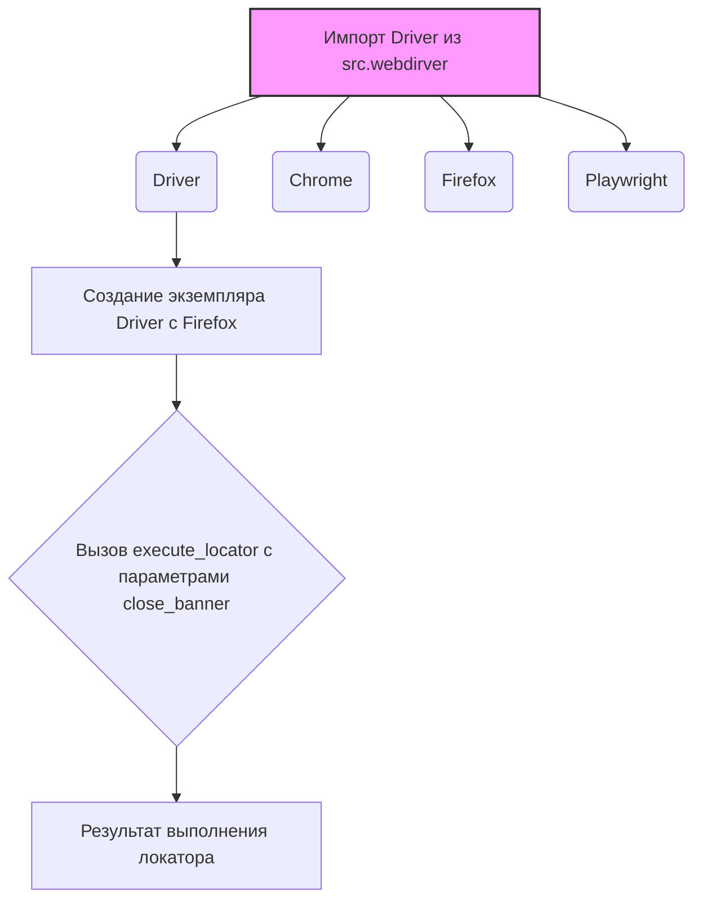

### **Системные инструкции для обработки кода проекта `hypotez`**

=========================================================================================

Описание функциональности и правил для генерации, анализа и улучшения кода. Направлено на обеспечение последовательного и читаемого стиля кодирования, соответствующего требованиям.

---

### **Основные принципы**

#### **1. Общие указания**:
- Соблюдай четкий и понятный стиль кодирования.
- Все изменения должны быть обоснованы и соответствовать установленным требованиям.

#### **2. Комментарии**:
- Используй `#` для внутренних комментариев.
- Документация всех функций, методов и классов должна следовать такому формату: 
    ```python
        def function(param: str, param1: Optional[str | dict | str] = None) -> dict | None:
            """ 
            Args:
                param (str): Описание параметра `param`.
                param1 (Optional[str | dict | str], optional): Описание параметра `param1`. По умолчанию `None`.
    
            Returns:
                dict | None: Описание возвращаемого значения. Возвращает словарь или `None`.
    
            Raises:
                SomeError: Описание ситуации, в которой возникает исключение `SomeError`.

            Ехаmple:
                >>> function('param', 'param1')
                {'param': 'param1'}
            """
    ```
- Комментарии и документация должны быть четкими, лаконичными и точными.

#### **3. Форматирование кода**:
- Используй одинарные кавычки. `a:str = 'value'`, `print('Hello World!')`;
- Добавляй пробелы вокруг операторов. Например, `x = 5`;
- Все параметры должны быть аннотированы типами. `def function(param: str, param1: Optional[str | dict | str] = None) -> dict | None:`;
- Не используй `Union`. Вместо этого используй `|`.

#### **4. Логирование**:
- Для логгирования Всегда Используй модуль `logger` из `src.logger.logger`.
- Ошибки должны логироваться с использованием `logger.error`.
Пример:
    ```python
        try:
            ...
        except Exception as ex:
            logger.error('Error while processing data', ех, exc_info=True)
    ```
#### **5 Не используй `Union[]` в коде. Вместо него используй `|`
Например:
```python
x: str | int ...
```

---

### **Основные требования**:

#### **1. Формат ответов в Markdown**:
- Все ответы должны быть выполнены в формате **Markdown**.

#### **2. Формат комментариев**:
- Используй указанный стиль для комментариев и документации в коде.
- Пример:

```python
from typing import Generator, Optional, List
from pathlib import Path


def read_text_file(
    file_path: str | Path,
    as_list: bool = False,
    extensions: Optional[List[str]] = None,
    chunk_size: int = 8192,
) -> Generator[str, None, None] | str | None:
    """
    Считывает содержимое файла (или файлов из каталога) с использованием генератора для экономии памяти.

    Args:
        file_path (str | Path): Путь к файлу или каталогу.
        as_list (bool): Если `True`, возвращает генератор строк.
        extensions (Optional[List[str]]): Список расширений файлов для чтения из каталога.
        chunk_size (int): Размер чанков для чтения файла в байтах.

    Returns:
        Generator[str, None, None] | str | None: Генератор строк, объединенная строка или `None` в случае ошибки.

    Raises:
        Exception: Если возникает ошибка при чтении файла.

    Example:
        >>> from pathlib import Path
        >>> file_path = Path('example.txt')
        >>> content = read_text_file(file_path)
        >>> if content:
        ...    print(f'File content: {content[:100]}...')
        File content: Example text...
    """
    ...
```
- Всегда делай подробные объяснения в комментариях. Избегай расплывчатых терминов, 
- таких как *«получить»* или *«делать»*. Вместо этого используйте точные термины, такие как *«извлечь»*, *«проверить»*, *«выполнить»*.
- Вместо: *«получаем»*, *«возвращаем»*, *«преобразовываем»* используй имя объекта *«функция получае»*, *«переменная возвращает»*, *«код преобразовывает»* 
- Комментарии должны непосредственно предшествовать описываемому блоку кода и объяснять его назначение.\

#### **3. Пробелы вокруг операторов присваивания**:
- Всегда добавляйте пробелы вокруг оператора `=`, чтобы повысить читаемость.\
- Примеры:\
  - **Неправильно**: `x=5`\
  - **Правильно**: `x = 5`\

#### **4. Использование `j_loads` или `j_loads_ns`**:
- Для чтения JSON или конфигурационных файлов замените стандартное использование `open` и `json.load` на `j_loads` или `j_loads_ns`.\
- Пример:\

```python
# Неправильно:
with open('config.json', 'r', encoding='utf-8') as f:
    data = json.load(f)

# Правильно:
data = j_loads('config.json')
```

#### **5. Сохранение комментариев**:
- Все существующие комментарии, начинающиеся с `#`, должны быть сохранены без изменений в разделе «Улучшенный код».\
- Если комментарий кажется устаревшим или неясным, не изменяйте его. Вместо этого отметьте его в разделе «Изменения».\

#### **6. Обработка `...` в коде**:
- Оставляйте `...` как указатели в коде без изменений.\
- Не документируйте строки с `...`.\
```

#### **7. Аннотации**
Для всех переменных должны быть определены аннотации типа. 
Для всех функций все входные и выходные параметры аннотириваны
Для все параметров должны быть аннотации типа.\


### **8. webdriver**
В коде используется webdriver. Он импртируется из модуля `webdriver` проекта `hypotez`
```python
from src.webdirver import Driver, Chrome, Firefox, Playwright, ...
driver = Driver(Firefox)\

Пoсле чего может использоваться как

close_banner = {\
  "attribute": null,\
  "by": "XPATH",\
  "selector": "//button[@id = \'closeXButton\']",\
  "if_list": "first",\
  "use_mouse": false,\
  "mandatory": false,\
  "timeout": 0,\
  "timeout_for_event": "presence_of_element_located",\
  "event": "click()",\
  "locator_description": "Закрываю pop-up окно, если оно не появилось - не страшно (`mandatory`:`false`)"\
}\

result = driver.execute_locator(close_banner)\
```

### 1. Блок-схема:

```mermaid
graph TD
    A[Начало] --> B{Выбор веб-драйвера (например, Firefox)};
    B -- Выбран Firefox --> C[Создание экземпляра драйвера: `driver = Driver(Firefox)`];
    C --> D{Определение локатора для элемента (например, баннера)};
    D --> E[Выполнение локатора с использованием драйвера: `result = driver.execute_locator(close_banner)`];
    E --> F{Проверка результата выполнения локатора};
    F -- Успешно --> G[Действия выполнены (например, закрытие баннера)];
    F -- Ошибка --> H[Обработка ошибки (например, логирование)];
    G --> I[Конец];
    H --> I[Конец];
```

**Примеры для каждого блока:**

*   **A (Начало):** Начало выполнения скрипта.
*   **B (Выбор веб-драйвера):** Решение, какой браузер использовать для автоматизации (Chrome, Firefox и т.д.).
*   **C (Создание экземпляра драйвера):** Создание объекта драйвера для управления выбранным браузером. Пример: `driver = Driver(Firefox)`.
*   **D (Определение локатора):** Определение параметров для поиска элемента на веб-странице. Пример: `close_banner`.
*   **E (Выполнение локатора):** Поиск и выполнение действий с элементом, используя параметры локатора. Пример: `result = driver.execute_locator(close_banner)`.
*   **F (Проверка результата):** Проверка, успешно ли выполнено действие с элементом.
*   **G (Действия выполнены):** Выполнение действий, если локатор успешно найден и действие выполнено.
*   **H (Обработка ошибки):** Обработка ошибки, если локатор не найден или действие не выполнено.
*   **I (Конец):** Завершение выполнения скрипта.

### 2. Диаграмма:



**Анализ зависимостей:**

*   `Driver`, `Chrome`, `Firefox`, `Playwright` импортируются из модуля `src.webdirver`. Это предполагает, что `src.webdirver` предоставляет классы для управления различными веб-браузерами.
*   `Driver` используется для создания экземпляра веб-драйвера, а `Chrome`, `Firefox`, `Playwright` представляют конкретные реализации драйверов для этих браузеров.
*   `execute_locator` - это метод класса `Driver`, который выполняет поиск элемента на странице и производит заданное действие.

### 3. Объяснение:

*   **Импорты**:
    *   `src.webdirver`: Модуль, содержащий классы для управления веб-браузерами (WebDriver).  `Driver` - базовый класс, а `Chrome`, `Firefox`, `Playwright` - его реализации для соответствующих браузеров.
*   **Переменные**:
    *   `driver`: Экземпляр класса `Driver`, используемый для управления веб-браузером.
    *   `close_banner`: Словарь, содержащий параметры для поиска и выполнения действий с элементом веб-страницы.  Включает в себя `by` (метод поиска), `selector` (XPath-выражение), `event` (действие для выполнения) и другие параметры.
    *   `result`: Результат выполнения метода `execute_locator`.

**Потенциальные ошибки и области для улучшения:**

*   Не указана обработка возможных исключений при выполнении `driver.execute_locator`.  Рекомендуется добавить блок `try...except` для обработки возможных ошибок, таких как `NoSuchElementException` (элемент не найден) или `TimeoutException` (время ожидания истекло).
*   Отсутствует механизм логирования для отслеживания хода выполнения скрипта и записи ошибок.  Рекомендуется использовать модуль `logger` из `src.logger.logger` для логирования событий, особенно ошибок.
*   В `close_banner` значение `attribute` установлено в `null`. Возможно, следует уточнить, какое значение атрибута ожидается.
*   В `close_banner`  `locator_description` содержит пояснение на русском языке, что допустимо в данном контексте, но стоит унифицировать подход к локализации.

**Взаимосвязь с другими частями проекта:**

*   Данный код использует модуль `src.webdirver`, который, вероятно, является частью фреймворка для автоматизированного тестирования или сбора данных.
*   Модуль `src.logger.logger` используется для логирования, что позволяет отслеживать выполнение и диагностировать проблемы.