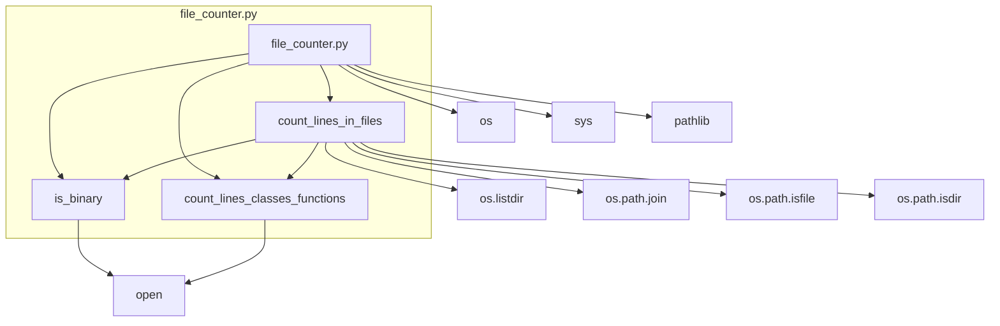

### **Анализ кода проекта `hypotez`**

=========================================================================================

#### **Расположение файла в проекте**:
Файл расположен в `hypotez/toolbox/file_counter.py`. Это указывает на то, что данный скрипт является частью утилит для разработчиков и предназначен для анализа файлов в проекте.

---

### **1. Блок-схема**

```mermaid
graph TD
    A[Начало] --> B{Указана ли директория для анализа?};
    B -- Да --> C[Инициализация счетчиков: total_lines = 0, total_classes = 0, total_functions = 0];
    B -- Нет --> End[Завершение];
    C --> D{Получение списка файлов и поддиректорий в директории};
    D --> E{Цикл по каждому элементу списка};
    E --> F{Является ли элемент файлом?};
    F -- Да --> G{Не бинарный файл, не __init__.py и не Jupyter Notebook?};
    G -- Да --> H[Открытие файла в текстовом режиме];
    H --> I[Подсчет строк, классов и функций в файле с помощью count_lines_classes_functions()];
    I --> J[Увеличение общего количества строк, классов и функций];
    G -- Нет --> K[Пропуск файла];
    F -- Нет --> L{Является ли элемент директорией?};
    L -- Да --> M{Исключить __pycache__ и скрытые директории?};
    M -- Да --> N[Рекурсивный вызов count_lines_in_files() для поддиректории];
    N --> O[Увеличение общего количества строк, классов и функций на значения, возвращенные рекурсивным вызовом];
    M -- Нет --> K[Пропуск директории];
    L -- Нет --> K[Пропуск элемента];
    J --> E;
    O --> E;
    E --> P{Все элементы списка обработаны?};
    P -- Да --> Q[Возврат общего количества строк, классов и функций];
    Q --> End[Завершение];
    K --> E;
    End[Конец];
```

**Примеры для каждого логического блока**:

-   **A (Начало)**: Начало выполнения скрипта.
-   **B (Указана ли директория для анализа?)**: Проверка, передана ли директория в качестве аргумента командной строки.
    -   *Пример*: `python file_counter.py /path/to/directory`
-   **C (Инициализация счетчиков)**: Установка начальных значений для `total_lines`, `total_classes` и `total_functions` в 0.
    -   *Пример*: `total_lines = 0`, `total_classes = 0`, `total_functions = 0`
-   **D (Получение списка файлов и поддиректорий в директории)**: Использование `os.listdir()` для получения списка элементов в указанной директории.
    -   *Пример*: `filenames = os.listdir(directory)`
-   **E (Цикл по каждому элементу списка)**: Перебор элементов, возвращенных `os.listdir()`\.
    -   *Пример*: `for filename in filenames:`
-   **F (Является ли элемент файлом?)**: Проверка, является ли текущий элемент файлом с помощью `os.path.isfile()`\.
    -   *Пример*: `if os.path.isfile(filepath):`
-   **G (Не бинарный файл, не \_\_init\_\_.py и не Jupyter Notebook?)**: Проверка, что файл не является бинарным, файлом `__init__.py` и не имеет расширение `.ipynb`.
    -   *Пример*: `if not is_binary(filepath) and not filename.endswith('.ipynb') and filename != '__init__.py':`
-   **H (Открытие файла в текстовом режиме)**: Открытие файла для чтения в текстовом режиме с указанием кодировки и обработкой ошибок.
    -   *Пример*: `with open(filepath, 'r', encoding='utf-8', errors='ignore') as file:`
-   **I (Подсчет строк, классов и функций в файле с помощью count\_lines\_classes\_functions())**: Вызов функции `count_lines_classes_functions()` для подсчета количества строк, классов и функций в файле.
    -   *Пример*: `lines_in_file, classes_in_file, functions_in_file = count_lines_classes_functions(file)`
-   **J (Увеличение общего количества строк, классов и функций)**: Добавление значений, возвращенных `count_lines_classes_functions()`, к общим счетчикам.
    -   *Пример*: `total_lines += lines_in_file`
-   **K (Пропуск файла)**: Если файл бинарный, является `__init__.py` или Jupyter Notebook, он пропускается.
-   **L (Является ли элемент директорией?)**: Проверка, является ли текущий элемент директорией с помощью `os.path.isdir()`\.
    -   *Пример*: `if os.path.isdir(filepath):`
-   **M (Исключить \_\_pycache\_\_ и скрытые директории?)**: Проверка, не является ли директория `__pycache__` или скрытой директорией (начинается с точки).
    -   *Пример*: `if not filename.startswith('__pycache__') or not filename.startswith('.'):`
-   **N (Рекурсивный вызов count\_lines\_in\_files() для поддиректории)**: Рекурсивный вызов `count_lines_in_files()` для подсчета строк, классов и функций в поддиректории.
    -   *Пример*: `nested_lines, nested_classes, nested_functions = count_lines_in_files(filepath)`
-   **O (Увеличение общего количества строк, классов и функций на значения, возвращенные рекурсивным вызовом)**: Добавление значений, возвращенных рекурсивным вызовом, к общим счетчикам.
    -   *Пример*: `total_lines += nested_lines`
-   **P (Все элементы списка обработаны?)**: Проверка, все ли файлы и директории в текущей директории обработаны.
-   **Q (Возврат общего количества строк, классов и функций)**: Возврат общих значений `total_lines`, `total_classes` и `total_functions`.
    -   *Пример*: `return total_lines, total_classes, total_functions`
-   **End (Завершение)**: Завершение выполнения скрипта.

### **2. Диаграмма зависимостей**



**Объяснение зависимостей**:

-   `file_counter.py`: Основной скрипт, который использует модули `os`, `sys` и `pathlib`. Он также определяет три функции: `count_lines_in_files`, `is_binary` и `count_lines_classes_functions`.
-   `os`: Модуль `os` используется для работы с операционной системой, например, для получения списка файлов и директорий (`os.listdir`), объединения путей (`os.path.join`), проверки, является ли путь файлом (`os.path.isfile`) или директорией (`os.path.isdir`).
-   `sys`: Модуль `sys` предоставляет доступ к некоторым переменным и функциям, взаимодействующим с интерпретатором Python. В данном коде не используется напрямую, но импортирован.
-   `pathlib`: Модуль `pathlib` используется для представления путей к файлам и директориям в виде объектов.
-   `count_lines_in_files`: Функция рекурсивно обходит указанную директорию и её поддиректории, подсчитывая количество строк, классов и функций в текстовых файлах. Она использует `os.listdir`, `os.path.join`, `os.path.isfile`, `os.path.isdir`, `is_binary` и `count_lines_classes_functions`.
-   `is_binary`: Функция проверяет, является ли файл бинарным, путем чтения первых 512 байт и поиска нулевых байтов. Она использует функцию `open` для открытия файла в бинарном режиме.
-   `count_lines_classes_functions`: Функция подсчитывает количество строк, классов и функций в файле. Она использует функцию `open` для построчного чтения файла.

### **3. Объяснение**

**Импорты**:

-   `os`: Используется для взаимодействия с операционной системой, например, для работы с файловой системой (перечисление файлов в каталоге, проверка типа файла и т.д.).
-   `sys`: Предоставляет доступ к некоторым переменным и функциям, взаимодействующим с интерпретатором Python.
-   `pathlib`:  Используется для представления путей к файлам и директориям в виде объектов `Path`.

**Функции**:

1.  **`count_lines_in_files(directory)`**:
    -   **Аргументы**:
        -   `directory` (str): Путь к директории, в которой необходимо подсчитать строки, классы и функции.
    -   **Возвращаемое значение**:
        -   Кортеж, содержащий общее количество строк (`total_lines`), классов (`total_classes`) и функций (`total_functions`).
    -   **Назначение**:
        -   Рекурсивно подсчитывает количество строк, классов и функций во всех текстовых файлах в указанной директории и её поддиректориях.
    -   **Пример**:

    ```python
    total_lines, total_classes, total_functions = count_lines_in_files('/path/to/your/directory')
    print(f"Total lines: {total_lines}, Total classes: {total_classes}, Total functions: {total_functions}")
    ```

2.  **`is_binary(filepath)`**:
    -   **Аргументы**:
        -   `filepath` (str): Путь к файлу, который необходимо проверить на бинарность.
    -   **Возвращаемое значение**:
        -   `True`, если файл является бинарным, и `False` в противном случае.
    -   **Назначение**:
        -   Определяет, является ли файл бинарным, проверяя наличие нулевых байтов в первых 512 байтах файла.
    -   **Пример**:

    ```python
    if is_binary('/path/to/your/file.txt'):
        print("The file is binary.")
    else:
        print("The file is not binary.")
    ```

3.  **`count_lines_classes_functions(file)`**:
    -   **Аргументы**:
        -   `file` (file object): Объект файла, открытого для чтения.
    -   **Возвращаемое значение**:
        -   Кортеж, содержащий количество строк (`lines`), классов (`classes_count`) и функций (`functions_count`) в файле.
    -   **Назначение**:
        -   Подсчитывает количество строк, классов и функций в открытом файле.
    -   **Пример**:

    ```python
    with open('/path/to/your/file.txt', 'r') as f:
        lines, classes, functions = count_lines_classes_functions(f)
        print(f"Lines: {lines}, Classes: {classes}, Functions: {functions}")
    ```

**Переменные**:

-   `MODE`: Константа, определяющая режим работы скрипта (в данном случае `'development'`).
-   `dir_root`: Определяется как корневая директория проекта (`hypotez`).
-   `dir_src`: Определяется как поддиректория `src` внутри корневой директории проекта.

**Потенциальные ошибки и области для улучшения**:

1.  **Обработка исключений**: В функции `is_binary` при возникновении исключения при чтении файла, файл считается бинарным. Это может быть не всегда корректно. Возможно, стоит добавить более детальную обработку исключений.
2.  **Улучшение определения бинарных файлов**: Проверка на бинарность только по первым 512 байтам может быть недостаточной. Можно рассмотреть использование более надежных методов определения бинарных файлов.
3.  **Кодировка файлов**: Кодировка `'utf-8'` и обработка ошибок `'ignore'` могут приводить к потере данных при чтении файлов с некорректной кодировкой. Можно добавить возможность указания кодировки в качестве параметра.
4.  **Комментарии и документация**:  Документация модуля и функций неполная. Следует добавить более подробное описание каждой функции, её аргументов и возвращаемых значений.
5.  **Анализ кода**: В функции `count_lines_classes_functions` код анализирует только строки, начинающиеся с `class` и `def`. Это может привести к неверному подсчету классов и функций, если они определены в нестандартном стиле.

**Взаимосвязи с другими частями проекта**:

-   Этот скрипт может использоваться для анализа кодовой базы проекта `hypotez`, чтобы оценить её размер, сложность и структуру.  Результаты могут быть использованы для принятия решений о рефакторинге, улучшении качества кода и планировании разработки.
-   Переменные `dir_root` и `dir_src` явно указывают на то, что скрипт предназначен для работы с проектом `hypotez` и предполагает определенную структуру директорий.