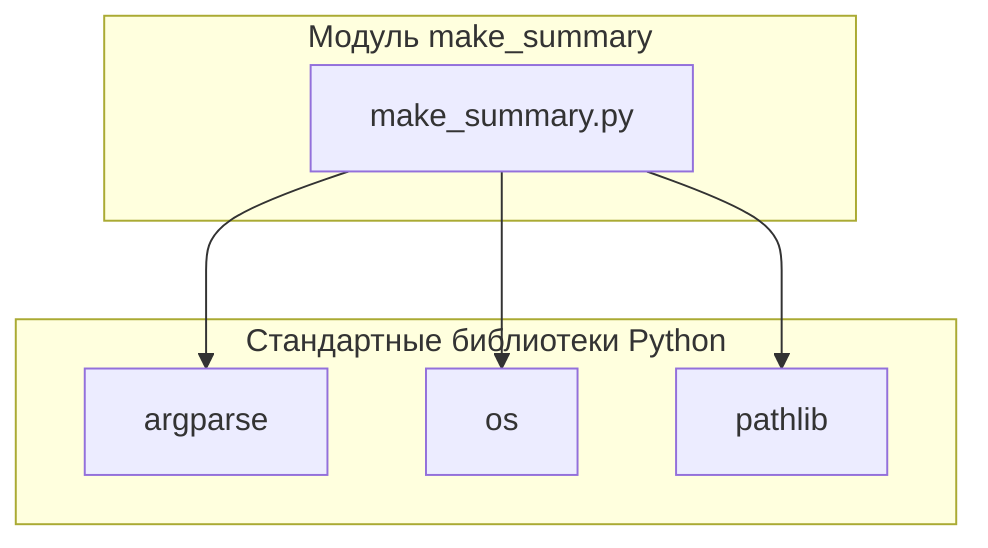

## Анализ кода модуля `make_summary.md`

### Качество кода:
- **Соответствие стандартам**: 7/10
- **Плюсы**:
    - Подробное описание функциональности модуля и функции `main`.
    - Описание аргументов командной строки и их влияния на работу скрипта.
    - Примеры запуска скрипта из командной строки.
- **Минусы**:
    - Отсутствует описание импортируемых модулей и их роли.
    - Нет информации о зависимостях модуля от других модулей проекта `hypotez`.
    - Не указаны константы, используемые в модуле (если есть).
    - Отсутствует описание структуры генерируемого файла `SUMMARY.md`.
    - docstring функции `main` не соответствует формату.

### Рекомендации по улучшению:

1.  **Добавить описание импортируемых модулей**:
    - Указать, какие модули импортируются и для чего они используются.
2.  **Описать зависимость от других модулей `hypotez`**:
    - Если модуль зависит от других модулей проекта, указать это и описать взаимодействие.
3.  **Добавить описание структуры генерируемого файла `SUMMARY.md`**:
    - Описать формат файла `SUMMARY.md`, который генерируется скриптом.
4. **Привести docstring функции `main` к требуемому формату**:
    - Изменить docstring в соответствии с указанным форматом.

### Оптимизированный код:

```python
                # Документация модуля `make_summary.md`

## Обзор

Модуль предназначен для автоматической генерации файла `SUMMARY.md`, который используется для компиляции документации с помощью таких инструментов, как `mdbook`. Модуль рекурсивно обходит указанный каталог, содержащий исходные `.md` файлы, и генерирует оглавление, включая или исключая файлы на основе указанного языка.

## Подробнее

Этот модуль автоматизирует процесс создания файла `SUMMARY.md`, который необходим для `mdbook` и других инструментов для генерации документации. Он фильтрует файлы по языку (русский или английский), чтобы в оглавление включались только релевантные файлы. Все пути указываются относительно корня проекта, что обеспечивает устойчивость модуля к изменениям структуры каталогов.

## Классы

### `make_summary.py`

**Описание**: В данном файле нет классов. Модуль содержит функциональность для создания файла `SUMMARY.md`, который используется для компиляции документации.

## Функции

### `main`

```python
def main() -> None:
    """
    Основная функция скрипта.
    Анализирует аргументы командной строки, генерирует файл SUMMARY.md.

    Args:
        None

    Returns:
        None

    Raises:
        FileNotFoundError: Если указанный исходный каталог не существует.
        Exception: При возникновении любых других ошибок в процессе генерации.

    Пример использования:
        python src/endpoints/hypo69/code_assistant/make_summary.py -lang ru src
    """
```

**Назначение**: Основная функция скрипта, отвечающая за анализ аргументов командной строки и генерацию файла `SUMMARY.md`.

**Импортируемые модули**:
- `argparse`: Для анализа аргументов командной строки.
- `os`: Для работы с файловой системой.
- `pathlib`: Для работы с путями к файлам.

**Параметры**:
- Отсутствуют.

**Возвращает**:
- `None`

**Вызывает исключения**:
- `FileNotFoundError`: Если указанный исходный каталог не существует.
- `Exception`: При возникновении любых других ошибок в процессе генерации.

**Структура генерируемого файла `SUMMARY.md`**:
Файл `SUMMARY.md` представляет собой текстовый файл в формате Markdown, содержащий оглавление для документации. Каждая строка файла содержит ссылку на соответствующий файл документации.
Пример:
```markdown
- [Введение](introduction.md)
- [Глава 1](chapter1.md)
    - [Раздел 1.1](chapter1/section1.1.md)
- [Глава 2](chapter2.md)
```

**Внутренние функции**:
- Отсутствуют.

**Как работает функция**:
1. **Анализ аргументов командной строки**: Функция использует `argparse` для получения аргументов командной строки, таких как язык (`-lang`) и исходный каталог (`src`).
2. **Определение целевого каталога**: Определяет целевой каталог для сохранения файла `SUMMARY.md` (`docs`).
3. **Создание целевого каталога**: Если целевой каталог не существует, он создается.
4. **Формирование списка файлов**: Использует функцию `os.walk` для рекурсивного обхода исходного каталога и формирования списка файлов с расширением `.md`.
5. **Фильтрация файлов по языку**: Фильтрует список файлов в зависимости от указанного языка (`ru` или `en`). Если указан русский язык, включаются только файлы с суффиксом `.ru.md`. Если указан английский язык, исключаются файлы с суффиксом `.ru.md`.
6. **Создание содержимого файла `SUMMARY.md`**: Формирует содержимое файла `SUMMARY.md` в формате Markdown, где каждая строка представляет собой ссылку на соответствующий файл.
7. **Запись содержимого в файл `SUMMARY.md`**: Записывает сформированное содержимое в файл `SUMMARY.md` в целевом каталоге.
8. **Обработка исключений**: Обрабатывает исключения, такие как отсутствие исходного каталога (`FileNotFoundError`) и другие ошибки, возникающие в процессе генерации. В случае ошибки, выводит сообщение об ошибке в консоль.

**Примеры**:
Примеры запуска скрипта из командной строки:

```bash
python src/endpoints/hypo69/code_assistant/make_summary.py -lang ru src
python src/endpoints/hypo69/code_assistant/make_summary.py -lang en src
```

### `if __name__ == "__main__":`

```python
if __name__ == "__main__":
    main()
```

**Назначение**: Обеспечивает запуск функции `main`, только если скрипт запущен как основная программа.

**Параметры**:
- Отсутствуют.

**Возвращает**:
- Отсутствует.

**Вызывает исключения**:
- Отсутствуют.

**Как работает функция**:
Проверяет, является ли текущий модуль основным, и если да, вызывает функцию `main`.

**Примеры**:
Примеры запуска скрипта из командной строки:

```bash
python src/endpoints/hypo69/code_assistant/make_summary.py -lang ru src
python src/endpoints/hypo69/code_assistant/make_summary.py -lang en src
```
                ```

## 1. Блок-схема

```mermaid
graph LR
    A[Начало] --> B{Аргументы командной строки};
    B -- Есть аргументы --> C{Определение целевого каталога};
    B -- Нет аргументов --> E[Вывод справки и завершение];
    C --> D{Создание целевого каталога (если необходимо)};
    D --> F{Формирование списка .md файлов};
    F --> G{Фильтрация файлов по языку};
    G -- Язык указан --> H{Формирование содержимого SUMMARY.md};
    G -- Язык не указан --> I[Включить все .md файлы];
    H --> J{Запись содержимого в SUMMARY.md};
    I --> J
    J --> K[Конец];
    K -- Успешно --> L[Файл SUMMARY.md создан];
    K -- Ошибка --> M[Вывод сообщения об ошибке];
```

**Примеры для логических блоков:**

- **B{Аргументы командной строки}**:
    - Пример: `python make_summary.py -lang ru src`
    - Пример: `python make_summary.py -lang en docs`
- **D{Создание целевого каталога (если необходимо)}**:
    - Если каталога `docs` не существует, он будет создан.
- **G{Фильтрация файлов по языку}**:
    - Если указан `-lang ru`, то включаются только файлы с `.ru.md`.
    - Если указан `-lang en`, то файлы с `.ru.md` исключаются.

## 2. Диаграмма зависимостей



**Объяснение зависимостей:**

-   **argparse**: Используется для обработки аргументов командной строки, позволяя скрипту принимать параметры, такие как язык и путь к исходному каталогу.
-   **os**: Предоставляет функции для взаимодействия с операционной системой, такие как работа с файловой системой (создание каталогов, обход дерева каталогов).
-   **pathlib**:  Облегчает работу с путями к файлам и каталогам, предоставляя объектно-ориентированный интерфейс.

## 3. Объяснение

**Импорты:**

-   `argparse`: Модуль используется для разбора аргументов командной строки, что позволяет пользователю указывать параметры, такие как язык и исходный каталог.
-   `os`: Модуль предоставляет функции для взаимодействия с операционной системой, включая работу с файловой системой.
-   `pathlib`: Модуль предоставляет классы для представления путей к файлам и каталогам, что упрощает работу с файловой системой.

**Классы:**

-   В данном файле нет классов.

**Функции:**

-   `main()`:
    -   **Аргументы:** Нет.
    -   **Возвращаемое значение:** `None`.
    -   **Назначение:** Основная функция скрипта, которая анализирует аргументы командной строки, формирует список файлов, фильтрует их по языку и создает файл `SUMMARY.md`.
    -   **Пример:**
        ```bash
        python src/endpoints/hypo69/code_assistant/make_summary.py -lang ru src
        ```

**Переменные:**

-   Переменные используются внутри функции `main` для хранения аргументов командной строки, путей к файлам и содержимого файла `SUMMARY.md`.

**Потенциальные ошибки и области для улучшения:**

-   Отсутствует обработка ситуаций, когда указанный язык не поддерживается (например, если указан `-lang de`).
-   Нет проверки на существование исходных файлов перед их добавлением в `SUMMARY.md`.
-   Docstring функции `main` не соответствует формату.

**Взаимосвязи с другими частями проекта:**

-   Модуль `make_summary.py` располагается в директории `src/endpoints/hypo69/code_assistant/`, что указывает на его принадлежность к подсистеме `code_assistant` в рамках функциональности `hypo69`.  Этот модуль может использоваться для автоматической генерации документации для других модулей проекта.