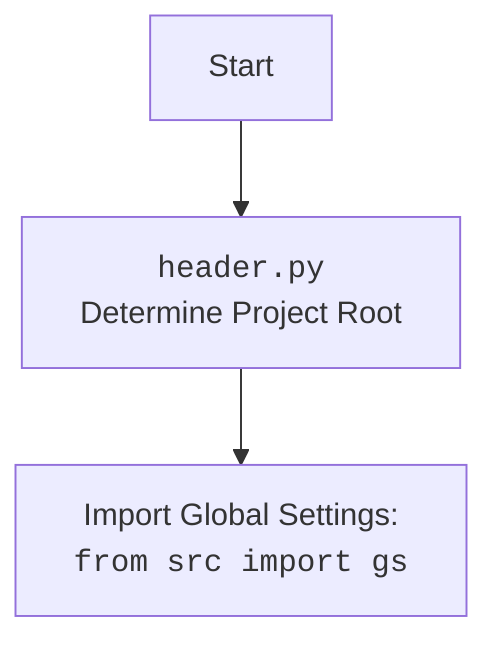

### **Анализ кода `hypotez/toolbox/mdbook_create_summary.py`**

### 1. Блок-схема

```mermaid
graph TD
    A[Начало: Определение путей к исходным .md файлам и файлу SUMMARY.md] --> B{Проверка существования файла SUMMARY.md};
    B -- Файл не существует --> C[Создание файла SUMMARY.md];
    B -- Файл существует --> D[Перезапись файла SUMMARY.md];
    C --> E[Открытие файла SUMMARY.md для записи];
    D --> E;
    E --> F[Запись заголовка "# Summary" в файл];
    F --> G[Рекурсивный обход директории с .md файлами];
    G --> H{Имя файла == "SUMMARY.md"?};
    H -- Да --> G;
    H -- Нет --> I[Формирование относительного пути и названия главы];
    I --> J[Определение уровня вложенности];
    J --> K[Запись главы в файл SUMMARY.md с учетом отступов];
    K --> L{Больше .md файлов?};
    L -- Да --> G;
    L -- Нет --> M[Закрытие файла SUMMARY.md];
    M --> N[Вывод сообщения об успешном создании/перезаписи файла];
    N --> O[Конец];
```

### 2. Диаграмма

```mermaid
flowchart TD
    A[<code>mdbook_create_summary.py</code><br>Создание SUMMARY.md для mdbook] --> B(pathlib);
    A --> C(header);
    A --> D[<code>src</code><br>gs (Global Settings)];
    B --> E[Path];
    style A fill:#f9f,stroke:#333,stroke-width:2px
    style B fill:#ccf,stroke:#333,stroke-width:2px
    style C fill:#ccf,stroke:#333,stroke-width:2px
    style D fill:#ccf,stroke:#333,stroke-width:2px
    style E fill:#ccf,stroke:#333,stroke-width:2px
```

Данная диаграмма `mermaid` отражает зависимости модуля `mdbook_create_summary.py`. Он импортирует:
- `pathlib` для работы с путями файловой системы.
- `header` для общих задач инициализации.
- `gs` (Global Settings) из пакета `src` для получения глобальных настроек, в частности, корневого пути проекта.



### 3. Объяснение

#### Импорты:
- `pathlib`: Модуль `pathlib` используется для работы с файловыми путями в объектно-ориентированном стиле. В данном случае, он применяется для определения путей к директории с `.md` файлами и к файлу `SUMMARY.md`. Класс `Path` из этого модуля позволяет удобно манипулировать путями, например, объединять их, получать относительные пути и проверять существование файлов.
- `header`: Импортируется для каких-то общих задач, вероятно, инициализации или настройки среды.
- `src.gs`: `gs` (Global Settings) из пакета `src` используется для доступа к глобальным настройкам проекта, таким как корневой путь. Это позволяет скрипту находить директорию с документацией независимо от текущего рабочего каталога.

#### Переменные:
- `src_path: Path`: Объект `Path`, представляющий путь к директории, содержащей исходные `.md` файлы. Этот путь формируется на основе корневого пути, полученного из `gs.path.root`, и константных составляющих (`'docs'`, `'gemini'`, `'consultant'`, `'ru'`, `'src'`).
- `summary_path: Path`: Объект `Path`, представляющий путь к файлу `SUMMARY.md`, который будет создан или перезаписан. Он формируется путем добавления имени файла `SUMMARY.md` к `src_path`.

#### Функции:
- `make_summary(src_dir: Path = src_path, summary_file: Path = summary_path) -> None`:
    - **Аргументы**:
        - `src_dir (Path)`: Путь к директории с исходными `.md` файлами. По умолчанию используется значение `src_path`.
        - `summary_file (Path)`: Путь для сохранения файла `SUMMARY.md`. По умолчанию используется значение `summary_path`.
    - **Возвращаемое значение**:
        - `None`: Функция ничего не возвращает.
    - **Назначение**:
        Функция рекурсивно обходит указанную директорию (`src_dir`) в поисках `.md` файлов и создает на их основе файл `SUMMARY.md` по указанному пути (`summary_file`). Файл `SUMMARY.md` содержит список глав, соответствующих найденным `.md` файлам, с учетом структуры директорий.

    - **Пример использования**:
        ```python
        from pathlib import Path
        from src import gs  # Предполагается, что gs инициализирован где-то еще

        # Пример пути (предполагается, что gs.path.root определен)
        example_src_path = Path(gs.path.root / 'docs' / 'example')
        example_summary_file = example_src_path / 'SUMMARY.md'

        # Создаем директорию и несколько файлов для примера
        example_src_path.mkdir(parents=True, exist_ok=True)
        (example_src_path / 'file1.md').write_text('# File 1')
        (example_src_path / 'subdir').mkdir(exist_ok=True)
        (example_src_path / 'subdir' / 'file2.md').write_text('# File 2')

        # Вызываем функцию для создания SUMMARY.md
        make_summary(example_src_path, example_summary_file)

        # Теперь в example_summary_file будет сгенерированный SUMMARY.md
        ```
        После выполнения этого примера в `example_summary_file` будет создан файл со следующим содержимым:
        ```
        # Summary

        - [File1](file1.md)
        - [File2](subdir/file2.md)
        ```

#### Потенциальные ошибки и области для улучшения:
- **Обработка исключений**: В коде отсутствует обработка исключений. Если во время обхода директории или записи в файл произойдет ошибка, скрипт аварийно завершится. Рекомендуется добавить блоки `try...except` для обработки возможных исключений, таких как `FileNotFoundError`, `PermissionError` и `OSError`.
- **Логирование**: Вместо использования `print` для вывода сообщений, рекомендуется использовать модуль `logging` для более гибкого и информативного логирования. Это позволит настраивать уровень детализации логов и направлять их в разные места (например, в файл).
- **Конфигурируемость**: Пути к директории с исходниками и файлу `SUMMARY.md` жестко заданы в коде. Было бы полезно сделать их конфигурируемыми, например, через аргументы командной строки или переменные окружения.

#### Взаимосвязи с другими частями проекта:
- Скрипт использует `gs.path.root` для определения корневого пути проекта. Это предполагает, что в проекте существует механизм для определения и хранения глобальных настроек.
-  Взаимодействует с файловой системой через модуль `pathlib`, что позволяет создавать, читать и записывать файлы и директории.