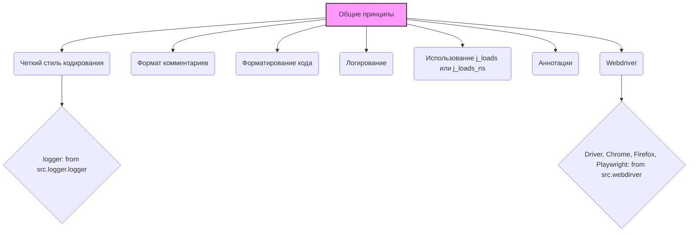

### **Системные инструкции для обработки кода проекта `hypotez`**

=========================================================================================

Описание функциональности и правил для генерации, анализа и улучшения кода. Направлено на обеспечение последовательного и читаемого стиля кодирования, соответствующего требованиям.

---

### **Основные принципы**

#### **1. Общие указания**:
- Соблюдай четкий и понятный стиль кодирования.
- Все изменения должны быть обоснованы и соответствовать установленным требованиям.

#### **2. Комментарии**:
- Используй `#` для внутренних комментариев.
- Документация всех функций, методов и классов должна следовать такому формату: 
    ```python
        def function(param: str, param1: Optional[str | dict | str] = None) -> dict | None:
            """ 
            Args:
                param (str): Описание параметра `param`.
                param1 (Optional[str | dict | str], optional): Описание параметра `param1`. По умолчанию `None`.
    
            Returns:
                dict | None: Описание возвращаемого значения. Возвращает словарь или `None`.
    
            Raises:
                SomeError: Описание ситуации, в которой возникает исключение `SomeError`.

            Ехаmple:
                >>> function('param', 'param1')
                {'param': 'param1'}
            """
    ```
- Комментарии и документация должны быть четкими, лаконичными и точными.

#### **3. Форматирование кода**:
- Используй одинарные кавычки. `a:str = 'value'`, `print('Hello World!')`;
- Добавляй пробелы вокруг операторов. Например, `x = 5`;
- Все параметры должны быть аннотированы типами. `def function(param: str, param1: Optional[str | dict | str] = None) -> dict | None:`;
- Не используй `Union`. Вместо этого используй `|`.\n\n#### **4. Логирование**:\n- Для логгирования Всегда Используй модуль `logger` из `src.logger.logger`.\n- Ошибки должны логироваться с использованием `logger.error`.\nПример:\n    ```python\n        try:\n            ...\n        except Exception as ex:\n            logger.error('Error while processing data', ех, exc_info=True)\n    ```\n#### **5 Не используй `Union[]` в коде. Вместо него используй `|`
Например:
```python
x: str | int ...
```

---

### **Основные требования**:

#### **1. Формат ответов в Markdown**:
- Все ответы должны быть выполнены в формате **Markdown**.\n\n#### **2. Формат комментариев**:\n- Используй указанный стиль для комментариев и документации в коде.\n- Пример:\n\n```python\nfrom typing import Generator, Optional, List\nfrom pathlib import Path\n\n\ndef read_text_file(\n    file_path: str | Path,\n    as_list: bool = False,\n    extensions: Optional[List[str]] = None,\n    chunk_size: int = 8192,\n) -> Generator[str, None, None] | str | None:\n    \"\"\"\n    Считывает содержимое файла (или файлов из каталога) с использованием генератора для экономии памяти.\n\n    Args:\n        file_path (str | Path): Путь к файлу или каталогу.\n        as_list (bool): Если `True`, возвращает генератор строк.\n        extensions (Optional[List[str]]): Список расширений файлов для чтения из каталога.\n        chunk_size (int): Размер чанков для чтения файла в байтах.\n\n    Returns:\n        Generator[str, None, None] | str | None: Генератор строк, объединенная строка или `None` в случае ошибки.\n\n    Raises:\n        Exception: Если возникает ошибка при чтении файла.\n\n    Example:\n        >>> from pathlib import Path\n        >>> file_path = Path('example.txt')\n        >>> content = read_text_file(file_path)\n        >>> if content:\n        ...    print(f'File content: {content[:100]}...')\n        File content: Example text...\n    \"\"\"\n    ...\n```
- Всегда делай подробные объяснения в комментариях. Избегай расплывчатых терминов, 
- таких как *«получить»* или *«делать»*
-  . Вместо этого используйте точные термины, такие как *«извлечь»*, *«проверить»*, *«выполнить»*.\n- Вместо: *«получаем»*, *«возвращаем»*, *«преобразовываем»* используй имя объекта *«функция получае»*, *«переменная возвращает»*, *«код преобразовывает»* 
- Комментарии должны непосредственно предшествовать описываемому блоку кода и объяснять его назначение.\n\n#### **3. Пробелы вокруг операторов присваивания**:\n- Всегда добавляйте пробелы вокруг оператора `=`, чтобы повысить читаемость.\n- Примеры:\n  - **Неправильно**: `x=5`\n  - **Правильно**: `x = 5`\n\n#### **4. Использование `j_loads` или `j_loads_ns`**:\n- Для чтения JSON или конфигурационных файлов замените стандартное использование `open` и `json.load` на `j_loads` или `j_loads_ns`.\n- Пример:\n\n```python\n# Неправильно:\nwith open('config.json', 'r', encoding='utf-8') as f:\n    data = json.load(f)\n\n# Правильно:\ndata = j_loads('config.json')\n```\n\n#### **5. Сохранение комментариев**:\n- Все существующие комментарии, начинающиеся с `#`, должны быть сохранены без изменений в разделе «Улучшенный код».\n- Если комментарий кажется устаревшим или неясным, не изменяйте его. Вместо этого отметьте его в разделе «Изменения».\n\n#### **6. Обработка `...` в коде**:\n- Оставляйте `...` как указатели в коде без изменений.\n- Не документируйте строки с `...`.\n```\n\n#### **7. Аннотации**\nДля всех переменных должны быть определены аннотации типа. \nДля всех функций все входные и выходные параметры аннотириваны\nДля все параметров должны быть аннотации типа.\n\n\n### **8. webdriver**\nВ коде используется webdriver. Он импртируется из модуля `webdriver` проекта `hypotez`\n```python\nfrom src.webdirver import Driver, Chrome, Firefox, Playwright, ...\ndriver = Driver(Firefox)\n\nПoсле чего может использоваться как\n\nclose_banner = {\n  "attribute": null,\n  "by": "XPATH",\n  "selector": "//button[@id = 'closeXButton']",\n  "if_list": "first",\n  "use_mouse": false,\n  "mandatory": false,\n  "timeout": 0,\n  "timeout_for_event": "presence_of_element_located",\n  "event": "click()",\n  "locator_description": "Закрываю pop-up окно, если оно не появилось - не страшно (`mandatory`:`false`)"\n}\n\nresult = driver.execute_locator(close_banner)\n                ```'}
```
## Анализ кода

Предоставленный код представляет собой набор системных инструкций для проекта `hypotez`, описывающих правила и рекомендации по стилю кодирования, документированию, форматированию и использованию определенных библиотек. Он не содержит исполняемого кода, а является руководством для разработчиков.

### 1. Блок-схема

```mermaid
flowchart TD
    A[Начало] --> B{Общие указания: Четкий стиль кодирования};
    B --> C{Комментарии: `#` для внутренних, формат для документации};
    C --> D{Форматирование кода: `'` одинарные кавычки, пробелы вокруг `=`, аннотации типов, `|` вместо `Union`};
    D --> E{Логирование: `src.logger.logger`, `logger.error` для ошибок};
    E --> F{Основные требования: Markdown, Формат комментариев, Пробелы вокруг `=`, `j_loads`/`j_loads_ns`, Сохранение комментариев, Обработка `...`, Аннотации};
    F --> G{Webdriver: Импорт из `src.webdirver`, использование `driver.execute_locator`};
    G --> H[Конец];
```

**Примеры для логических блоков:**

-   **Общие указания**:
    *   Соблюдение PEP 8.
    *   Использование осмысленных имен переменных.
-   **Комментарии**:
    *   `# Это комментарий.`
    *   Формат документации:

        ```python
        def function(param: str) -> None:
            """
            Args:
                param (str): Описание параметра `param`.
            """
            ...
        ```
-   **Форматирование кода**:
    *   `a: str = 'value'`
    *   `x = 5`
    *   `def function(param: str) -> None:`
    *   `x: str | int`
-   **Логирование**:

    ```python
    from src.logger.logger import logger

    try:
        ...
    except Exception as e:
        logger.error('Произошла ошибка', e, exc_info=True)
    ```
-   **Основные требования**:
    *   Ответы в формате Markdown.
    *   Использование `j_loads('config.json')` вместо `open` и `json.load`.
    *   Сохранение всех существующих комментариев.
    *   Аннотирование всех переменных и параметров функций.
-   **Webdriver**:

    ```python
    from src.webdirver import Driver, Firefox

    driver = Driver(Firefox)
    result = driver.execute_locator(locator)
    ```

### 2. Диаграмма



**Объяснение зависимостей:**

-   `src.logger.logger`: Используется для логирования. Инструкция предписывает всегда использовать этот модуль для логирования, особенно для ошибок.
-   `src.webdirver`:  Используется для автоматизации веб-браузера. Инструкция показывает, как импортировать и использовать `Driver` для выполнения действий с веб-элементами.

### 3. Объяснение

#### Импорты

-   `src.logger.logger`: Модуль логирования, используемый для записи информации о работе программы, включая ошибки.
-   `src.webdirver`:  Модуль для управления веб-браузерами (например, Chrome, Firefox) в автоматическом режиме.

#### Классы

-   `Driver` (из `src.webdirver`): Класс, представляющий собой драйвер для управления веб-браузером. Он позволяет выполнять различные действия, такие как открытие страниц, ввод данных, нажатие кнопок и т.д.

#### Функции

В предоставленном коде нет конкретных функций, но описывается формат документирования функций:

```python
def function(param: str, param1: Optional[str | dict | str] = None) -> dict | None:
    """
    Args:
        param (str): Описание параметра `param`.
        param1 (Optional[str | dict | str], optional): Описание параметра `param1`. По умолчанию `None`.

    Returns:
        dict | None: Описание возвращаемого значения. Возвращает словарь или `None`.

    Raises:
        SomeError: Описание ситуации, в которой возникает исключение `SomeError`.

    Example:
        >>> function('param', 'param1')
        {'param': 'param1'}
    """
    ...
```

#### Переменные

В основном описываются правила и примеры использования переменных.
-   Все переменные должны быть аннотированы типами (например, `x: str = "hello"`).
-   При присваивании значений оператору `=` должны быть пробелы (например, `x = 5`).

#### Потенциальные ошибки и области для улучшения

-   **Непоследовательность в использовании кавычек**: Хотя инструкция предписывает использование одинарных кавычек, в примерах кода встречаются и двойные.
-   **Недостаточная детализация примеров**: Некоторые примеры кода слишком общие и не показывают конкретное использование на практике.

#### Взаимосвязи с другими частями проекта

Этот код является частью общей системы инструкций для проекта `hypotez`. Он влияет на все остальные части проекта, определяя стандарты кодирования и документирования.