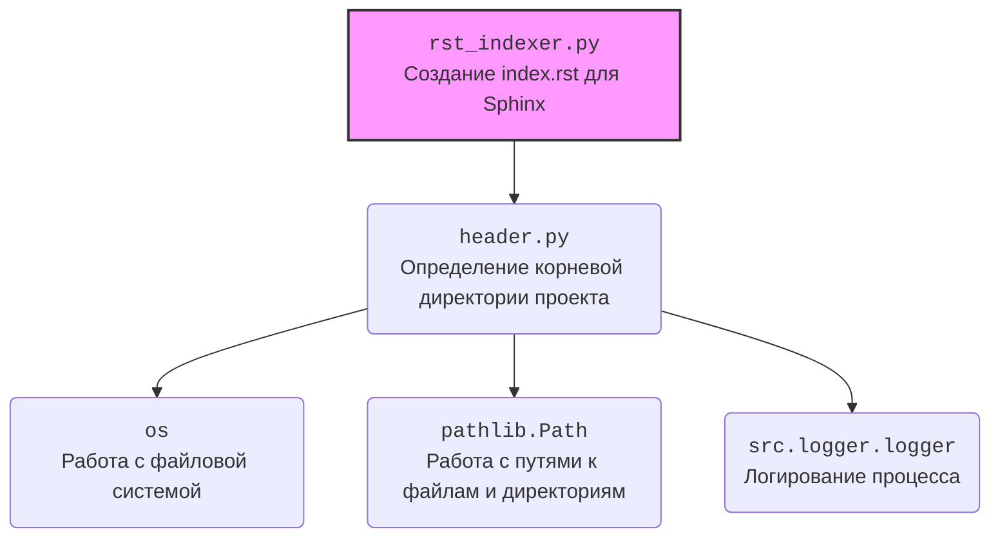

### Анализ кода `hypotez/toolbox/rst_indexer.py`

#### 1. Блок-схема

```mermaid
graph TD
    A[Начало: Вызов create_index_rst(start_dir)] --> B{Проверка существования docs_dir};
    B -- Нет --> C[Создание docs_dir];
    C --> D[Логирование: Создание каталога docs];
    B -- Да --> D;
    D --> E[Логирование: Начало создания index.rst];
    E --> F[Открытие index_file_path для записи];
    F --> G[Запись заголовка index.rst (Sphinx формат)];
    G --> H[Инициализация found_files = False];
    H --> I{Начало обхода os.walk(start_path)};
    I -- Для каждого root, _, files --> J[Фильтрация py_files: .py, без '(' и ')'];
    J --> K{Если py_files не пуст};
    K -- Да --> L[found_files = True];
    L --> M[Вычисление относительного пути rel_root];
    M --> N{Для каждого py_file в py_files};
    N --> O[Формирование module_path];
    O --> P[Удаление .py и замена os.sep на '.' в module_name];
    P --> Q[Запись module_name в index_file (Sphinx формат)];
    Q --> R[Логирование: Добавление Python файлов];
    N -- Конец цикла --> I;
    K -- Нет --> I;
    I -- Конец обхода --> S{Если not found_files};
    S -- Да --> T[Логирование: Нет Python файлов];
    T --> U[Запись сообщения "No modules found." в index_file];
    S -- Нет --> U;
    U --> V[Логирование: Успешная запись в файл];
    V --> W[Конец: Закрытие index_file];
    F -- Ошибка --> X[Логирование: Ошибка при создании index.rst];
    X --> Y[Выброс исключения];
```

#### 2. Диаграмма



#### 3. Объяснение

**Импорты:**

-   `header`: Определяет корневую директорию проекта. Используется для определения начальной точки обхода файлов.
-   `os`: Предоставляет функции для взаимодействия с операционной системой, такие как обход директорий (`os.walk`) и определение разделителя пути (`os.sep`).
-   `pathlib.Path`: Предлагает объектно-ориентированный способ работы с путями к файлам и директориям, упрощая операции, такие как создание директорий и вычисление относительных путей.
-   `src.logger.logger`: Модуль логирования, используемый для записи информации о процессе создания `index.rst`, включая ошибки.

**Классы:**

-   В явном виде классы не используются.

**Функции:**

-   `create_index_rst(start_dir: str) -> None`:\
    -   Аргументы:\
        -   `start_dir` (str): Корневая директория, с которой начинается обход поддиректорий.\
    -   Возвращаемое значение: `None`.\
    -   Назначение: Рекурсивно обходит поддиректории, начиная с `start_dir`, находит все файлы `*.py` (исключая файлы, содержащие символы "(" или ")"), и создает файл `index.rst` в директории `docs`, который содержит список этих файлов в формате, необходимом для Sphinx.\
    -   Пример: `create_index_rst(os.getcwd())` - создает `index.rst` для текущей директории.

**Переменные:**

-   `MODE: str = 'development'` - глобальная переменная, указывающая на режим работы приложения.
-   `start_path: Path` - объект `Path`, представляющий начальную директорию для обхода.
-   `docs_dir: Path` - объект `Path`, представляющий директорию `docs`, где будет создан файл `index.rst`.
-   `index_file_path: Path` - объект `Path`, представляющий путь к файлу `index.rst`.
-   `found_files: bool` - флаг, указывающий, были ли найдены какие-либо файлы Python.
-   `root: str` - текущая директория в процессе обхода `os.walk`.
-   `files: list` - список файлов в текущей директории `root`.
-   `py_files: list` - отфильтрованный список файлов, содержащий только файлы Python (с расширением `.py`).
-   `rel_root: Path` - относительный путь от `start_path` до текущей директории `root`.
-   `py_file: str` - имя текущего файла Python.
-   `module_path: Path` - объект `Path`, представляющий путь к модулю относительно `start_path`.
-   `module_name: str` - имя модуля, полученное из `module_path` путем удаления расширения `.py` и замены разделителей директорий на точки.

**Потенциальные ошибки и области для улучшения:**

-   Обработка исключений: В случае возникновения исключения во время создания `index.rst`, оно логируется и перевыбрасывается. Возможно, стоит добавить более детальную обработку исключений, чтобы, например, попытаться продолжить обработку других файлов в случае ошибки с одним файлом.
-   Исключение файлов: Сейчас исключаются файлы, содержащие символы "(" или ")". Это может быть недостаточно гибким. Возможно, стоит добавить возможность настройки списка исключаемых файлов или директорий.

**Взаимосвязь с другими частями проекта:**

-   `header`: Модуль `header` используется для определения корневой директории проекта. Это позволяет скрипту правильно определять, где начинать поиск файлов для индексации, и где создавать `index.rst`.

```mermaid
flowchart TD
    Start --> Header[<code>header.py</code><br> Determine Project Root]

    Header --> import[Import Global Settings: <br><code>from src import gs</code>]
                ```