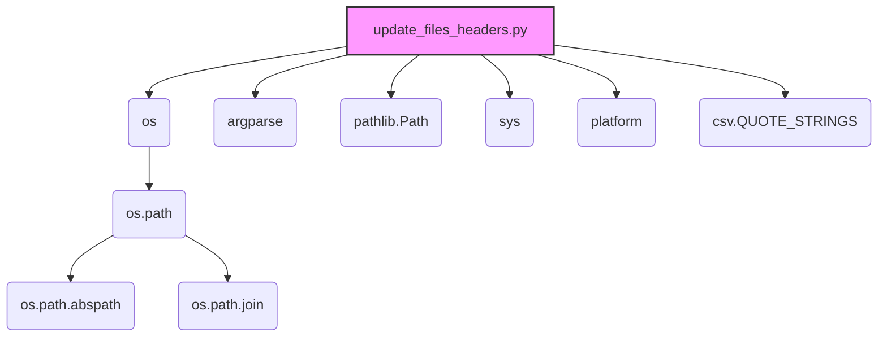
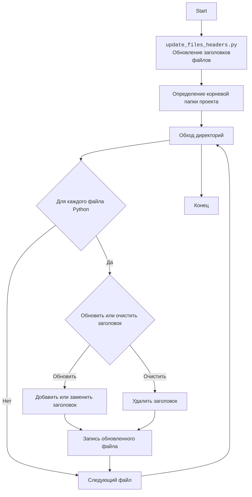

### **Анализ кода `hypotez/toolbox/update_files_headers.py.md`**

### 1. Блок-схема

```mermaid
graph LR
    A[Начало] --> B{Определение аргументов командной строки: force-update, clean, project}
    B -- clean=True --> C[Вызов функции traverse_and_clean(project_root)]
    B -- clean=False --> D[Вызов функции traverse_and_update(project_root, force_update)]
    C --> E[Функция traverse_and_clean: обход файлов и очистка заголовков]
    D --> F[Функция traverse_and_update: обход файлов и обновление заголовков]
    E --> G{Для каждого файла: вызов функции clean(file)}
    F --> H{Для каждого файла: вызов функции add_or_replace_file_header(file, project_root, force_update)}
    G --> I[Функция clean: удаление строк заголовков]
    H --> J[Функция add_or_replace_file_header: добавление или замена заголовков]
    I --> K[Запись отфильтрованных строк обратно в файл]
    J --> L[Определение необходимых строк заголовка]
    L --> M[Чтение строк файла]
    M --> N[Фильтрация существующих строк заголовка]
    N --> O{Необходимо обновление?}
    O -- Да --> P[Запись новых строк заголовка и отфильтрованных строк в файл]
    O -- Нет --> Q[Сообщение об отсутствии необходимости обновления]
    P --> R[Конец обработки файла]
    Q --> R
    K --> R
```

**Примеры для логических блоков:**

- **B (Определение аргументов командной строки):**
  - Пример 1: `python update_files_headers.py --force-update` (аргумент `force_update` установлен в `True`).
  - Пример 2: `python update_files_headers.py --clean` (аргумент `clean` установлен в `True`).
  - Пример 3: `python update_files_headers.py -p /path/to/project` (аргумент `project` указывает путь к корневой папке проекта).

- **G (Для каждого файла: вызов функции `clean(file)`):**
  - Пример: Если текущий файл `example.py`, то вызывается функция `clean("example.py")`.

- **H (Для каждого файла: вызов функции `add_or_replace_file_header(file, project_root, force_update)`):**
  - Пример: Если текущий файл `example.py`, корневая папка проекта `/path/to/project`, и `force_update` установлен в `True`, то вызывается функция `add_or_replace_file_header("example.py", "/path/to/project", True)`.

- **O (Необходимо обновление?):**
  - Пример 1: Если в файле отсутствуют строки заголовка, то `needs_update` будет `True`.
  - Пример 2: Если содержимое строк заголовка не соответствует ожидаемому, то `needs_update` будет `True`.
  - Пример 3: Если `force_update` установлен в `True`, то `needs_update` будет `True`.

### 2. Диаграмма



**Объяснение зависимостей:**

- **os**: Предоставляет функции для взаимодействия с операционной системой, такие как работа с путями к файлам и каталогам.
  - **os.path**: Подмодуль `os`, содержащий функции для манипулирования путями.
    - **os.path.abspath**: Используется для получения абсолютного пути к папке проекта.
    - **os.path.join**: Используется для объединения компонентов пути к файлу.
- **argparse**: Используется для разбора аргументов командной строки, позволяя скрипту принимать параметры, такие как `--force-update` и `--clean`.
- **pathlib.Path**: Предоставляет способ представления путей к файлам и каталогам в виде объектов, упрощая операции с путями.
- **sys**: Предоставляет доступ к некоторым переменным и функциям, взаимодействующим с интерпретатором Python, например, `sys.argv` для получения аргументов командной строки.
- **platform**: Предоставляет информацию об операционной системе и платформе, на которой выполняется скрипт.
- **csv.QUOTE_STRINGS**: Константа из модуля `csv`, которая, хотя и импортирована, не используется в предоставленном коде. Вероятно, это остаток от предыдущей версии скрипта или запланированная, но не реализованная функциональность.

### 3. Объяснение

**Импорты:**

- `os`: Используется для работы с файловой системой, например, для определения абсолютного пути к папке проекта и обхода директорий.
- `argparse`: Используется для обработки аргументов командной строки, что позволяет запускать скрипт с различными опциями (`--force-update`, `--clean`).
- `pathlib.Path`: Используется для представления путей к файлам и каталогам как объектов, упрощая манипуляции с путями.
- `sys`: Используется для доступа к параметрам и функциям, специфичным для среды выполнения Python.
- `platform`: Используется для получения информации о платформе, на которой запущен скрипт (Windows, Linux и т. д.).
- `csv.QUOTE_STRINGS`: Импортируется константа из модуля `csv`, но не используется в коде.

**Переменные:**

- `PROJECT_ROOT_FOLDER: str`: Определяет имя папки, которая считается корневой папкой проекта ("..").
- `EXCLUDE_DIRS: List[str]`: Список директорий, которые исключаются из обхода (`venv`, `tmp`, `docs`, `data`, `__pycache__`).
- `MODE: str`: Устанавливает режим работы проекта (`development`).

**Функции:**

- `find_project_root(start_path: Path, project_root_folder: str) -> Path`:\
    - **Аргументы:**
        - `start_path: Path`: Начальный путь для поиска корневой папки.
        - `project_root_folder: str`: Имя корневой папки проекта.
    - **Возвращаемое значение:**
        - `Path`: Путь к корневой папке проекта.
    - **Назначение:**
        - Функция `find_project_root` ищет корневую папку проекта, начиная с указанного пути, перемещаясь вверх по дереву каталогов, пока не найдет папку с именем `project_root_folder`.
    - **Пример:**
        ```python
        project_root = find_project_root(Path('.'), 'hypotez')
        print(project_root)  # Выводит путь к корневой папке 'hypotez'
        ```

- `get_interpreter_paths(project_root: Path) -> tuple`:\
    - **Аргументы:**
        - `project_root: Path`: Путь к корневой папке проекта.
    - **Возвращаемое значение:**
        - `tuple`: Кортеж путей к интерпретаторам Python для Windows и Linux/macOS.
    - **Назначение:**
        - Функция `get_interpreter_paths` возвращает пути к интерпретаторам Python, которые обычно используются в виртуальном окружении (`venv`).
    - **Пример:**
        ```python
        w_venv_interpreter, _, linux_venv_interpreter, _ = get_interpreter_paths(Path('.'))
        print(w_venv_interpreter)  # venv/Scripts/python.exe
        print(linux_venv_interpreter) # venv/bin/python/python3.12
        ```

- `add_or_replace_file_header(file_path: str, project_root: Path, force_update: bool)`:\
    - **Аргументы:**
        - `file_path: str`: Путь к файлу, который необходимо обновить.
        - `project_root: Path`: Путь к корневой папке проекта.
        - `force_update: bool`: Флаг, указывающий, следует ли принудительно обновить заголовок, даже если он уже существует.
    - **Возвращаемое значение:**
        - `None`
    - **Назначение:**
        - Функция `add_or_replace_file_header` добавляет или заменяет заголовок в указанном файле. Заголовок включает строку с путем к файлу, строку кодировки, строки с интерпретаторами для Windows и Linux, а также строку документации для модуля.
    - **Пример:**
        ```python
        add_or_replace_file_header('example.py', Path('.'), True)
        ```

- `clean(file_path: str)`:\
    - **Аргументы:**
        - `file_path: str`: Путь к файлу, из которого необходимо удалить заголовки.
    - **Возвращаемое значение:**
        - `None`
    - **Назначение:**
        - Функция `clean` удаляет определенные строки заголовков из файла, заменяя их пустыми строками.
    - **Пример:**
        ```python
        clean('example.py')
        ```

- `traverse_and_update(directory: Path, force_update: bool)`:\
    - **Аргументы:**
        - `directory: Path`: Директория, которую необходимо обойти.
        - `force_update: bool`: Флаг, указывающий, следует ли принудительно обновить заголовки.
    - **Возвращаемое значение:**
        - `None`
    - **Назначение:**
        - Функция `traverse_and_update` обходит указанную директорию и обновляет заголовки во всех файлах Python, вызывая функцию `add_or_replace_file_header` для каждого файла.
    - **Пример:**
        ```python
        traverse_and_update(Path('.'), True)
        ```

- `traverse_and_clean(directory: Path)`:\
    - **Аргументы:**
        - `directory: Path`: Директория, которую необходимо обойти.
    - **Возвращаемое значение:**
        - `None`
    - **Назначение:**
        - Функция `traverse_and_clean` обходит указанную директорию и очищает заголовки во всех файлах Python, вызывая функцию `clean` для каждого файла.
    - **Пример:**
        ```python
        traverse_and_clean(Path('.'))
        ```

- `main()`:\
    - **Аргументы:**
        - `None`
    - **Возвращаемое значение:**
        - `None`
    - **Назначение:**
        - Функция `main` является основной точкой входа в скрипт. Она определяет корневую папку проекта, обрабатывает аргументы командной строки и вызывает соответствующие функции для обновления или очистки заголовков файлов.

**Потенциальные ошибки и области для улучшения:**

1.  **Обработка исключений**: В функциях `add_or_replace_file_header` и `clean` обрабатывается только `IOError`.  Стоит рассмотреть возможность обработки других исключений, которые могут возникнуть при работе с файлами.
2.  **Использование `logger`**:  Вместо `print` для логирования можно использовать модуль `logger` из `src.logger.logger`. Это позволит более гибко настраивать вывод логов и упростит отладку.
3.  **Дублирование кода**:  Код для чтения и фильтрации строк файла в функциях `add_or_replace_file_header` и `clean`  практически идентичен.  Можно вынести этот код в отдельную функцию для повторного использования.
4.  **Удаление `csv.QUOTE_STRINGS`**: Поскольку `csv.QUOTE_STRINGS` не используется в коде, его следует удалить из списка импортов.
5.  **Улучшение логики определения необходимости обновления**:  Логика определения необходимости обновления заголовка может быть упрощена и улучшена.

**Цепочка взаимосвязей с другими частями проекта:**

- Скрипт `update_files_headers.py` предназначен для автоматического обновления заголовков файлов в проекте `hypotez`.  Он может использоваться как часть процесса сборки или развертывания проекта.  Он взаимодействует с файловой системой и может быть интегрирован с другими инструментами автоматизации.

